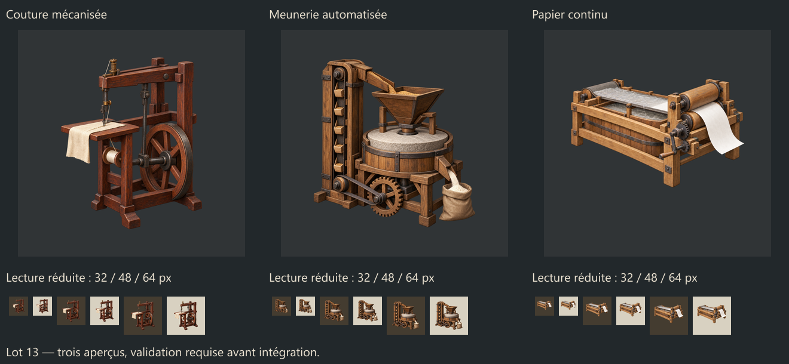

# Lot 13 — couture mécanisée, meunerie automatisée, papier continu

Statut : **aperçus uniquement, à valider par le joueur avant intégration**. Mode : imagegen intégré, trois créations et une édition ciblée du papier. Aucun test en jeu revendiqué.

## Sujets retenus

| Technologie affichée | Identifiant existant | Sujet | Master actif |
|---|---|---|---|
| Couture mécanisée | advanced_spinning | Machine à coudre ancienne en bois, aiguille exposée et tissu sous l’aiguille | previews/advanced_spinning_padded.png |
| Meunerie automatisée | automated_flour_milling | Meule, trémie et élévateur à godets reliés, farine recueillie dans un sac | previews/automated_flour_milling_padded.png |
| Papier continu | continuous_papermaking | Toile mobile sur cuve, rouleaux presseurs et bande blanche continue | paper_cleanup_v2/previews/continuous_papermaking_padded.png |

Le nom interne advanced_spinning ne désigne plus la filature dans la localisation actuelle : l’illustration suit bien la couture mécanisée. Aucun nom ni effet de technologie n’a été changé.

## Références historiques recherchées avant création

- [Machine à coudre de Thimonnier, Science Museum](https://collection.sciencemuseumgroup.org.uk/objects/co44718/copy-of-thimonniers-chain-stitch-sewing-machine-1830) : photographie du modèle/copie examinée, armature en bois, aiguille et bobine sous la table. Inspiration du modèle de 1830, pas une machine électrique tardive.
- [Système d’Oliver Evans, Mount Vernon](https://www.mountvernon.org/the-estate-gardens/gristmill/oliver-evans-systems) : schéma de circulation du grain examiné. L’icône résume le transport mécanique vers la mouture ; elle n’est pas une reproduction du moulin complet à plusieurs étages. Le site actuel est une reconstruction.
- [Machine à papier de Robert, Science Museum](https://collection.sciencemuseumgroup.org.uk/objects/co160281/roberts-paper-making-machine-1798) : photographie du modèle de la conception de 1798 examinée. La bande de papier a été accentuée pour rendre le procédé identifiable à petite taille.

Les photos externes n’ont pas été téléchargées, collées ou redistribuées. URLs, limites et observations : historical_references.json. Ce sont des illustrations simplifiées, pas des dessins mécaniques certifiés.

## Style et contrôles

Comparaison avec trois technologies vanilla locales : égreneuse, tour et outils mécaniques. Voir LOT_13_COMPARAISON_VANILLA.png et native_references.json.

Lecture à 32/48/64 px sur fonds clair/sombre, vraie transparence vérifiée avec LOT_13_ALPHA_DAMIER.png. Masters carrés de 1 574 px ; réduction PNG de 256 px. Le seul traitement local est l’ajout de marges transparentes : pixels RGBA de chaque source sélectionnée conservés exactement, ni peinture locale ni correction de teinte. Le petit fragment clair sous le papier a fait l’objet d’une édition imagegen ; un résidu extrêmement faible reste hors silhouette dans la source agrandie mais n’est pas discernable à la taille d’interface.

Les 1 238 fichiers common/gfx du point de départ restent inchangés, et aucun DDS de ce lot n’est présent. Le lot 12 approuvé est déjà intégré séparément. Le futur export, seulement après accord, devra être BGRA8 natif 256 × 256 avec neuf mipmaps et contrôle indépendant de couleur/alpha. Le cuivre et les sept anciens PM du laboratoire restent exclus.

## Provenance et reproduction

- generation_plan.json : les trois masters actifs et les futures cibles, sans branchement actuel.
- PROMPTS.md : les trois prompts initiaux exacts ; PAPER_CLEANUP_PROMPT.md : édition ciblée.
- generation_results.json : chemins générés d’origine conservés et copies de travail, empreintes, mode.
- canvas_padding.json et paper_cleanup_v2/canvas_padding.json : ajout mécanique de transparence sans retouche.
- initial_preview_snapshot/ : première planche et première preuve, conservées avant nettoyage du papier.
- preview_validation.json et visual_review.json : contrôles, limites et absence de test moteur.

Vérification reproductible : tools/build_asset12_preview_sheet.cjs --verify --pack=docs/reports/assets/asset16_preview_2026-10-05. Elle ne crée pas de DDS et ne touche pas aux fichiers du jeu.

## Intégration approuvée — 5 octobre 2026

Les trois masters actifs ci-dessus ont été explicitement approuvés par le joueur puis intégrés. Les mentions d’attente de validation décrivent la phase précédente. Voir integration_static_validation.json et LOT_13_DDS_INTEGRES_QA.png.

DDS BGRA8 natifs 256 × 256, neuf mipmaps ; couleurs et alpha identiques aux PNG réduits. Trois liens texture seulement ; 1 237 autres fichiers protégés inchangés. Aucun changement de gameplay et aucun test en jeu revendiqué.
