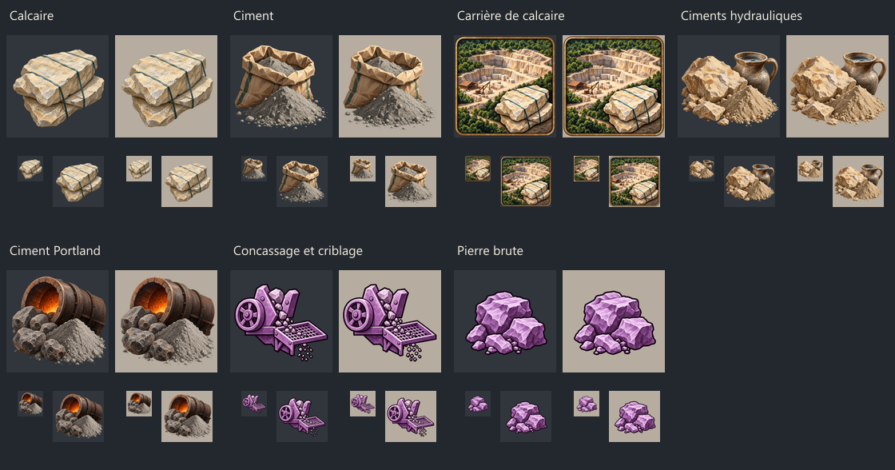
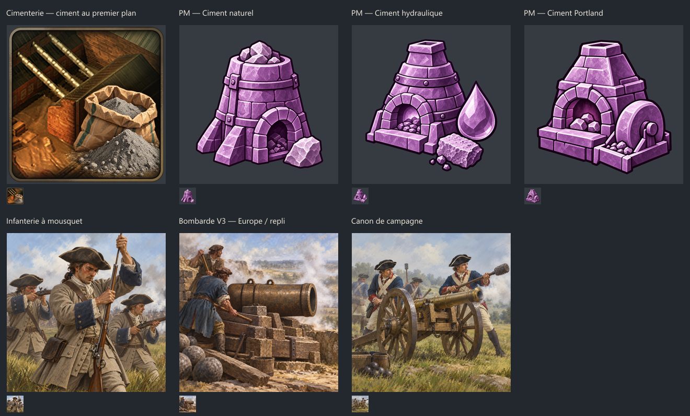
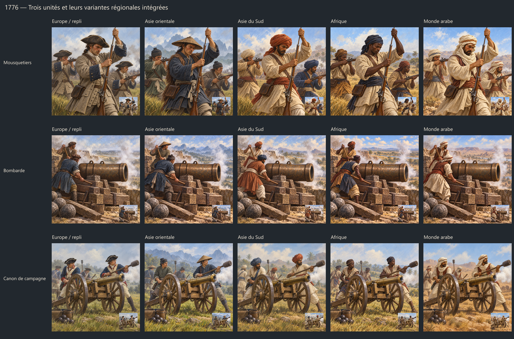
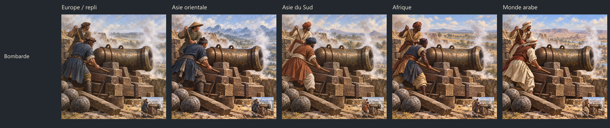
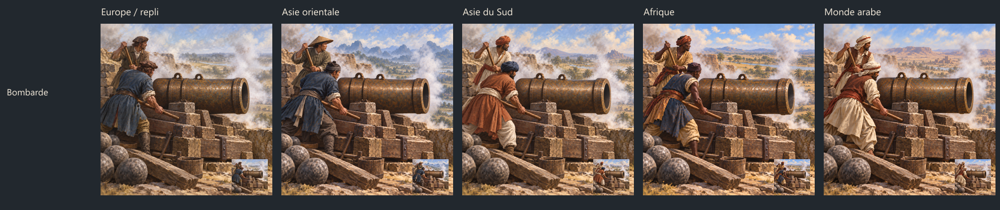

# Assets calcaire/ciment : intégration et aperçus

## Intégré dans le mod

Sept visuels fournis par le joueur remplacent les placeholders : calcaire,
ciment, carrière de calcaire, ciments hydrauliques, ciment Portland,
concassage/criblage et pierre brute. Les deux planches ont été séparées sans
recoloration ; le violet des PM fournis est conservé.

Les originaux sont conservés dans `sources/`, les PNG individuels dans
`masters/`. Les chemins DDS et fichiers consommateurs sont énumérés dans
[manifest.json](manifest.json). Les exports sont RGBA8 avec chaîne complète de
mips : 256 pixels pour les biens, technologies et bâtiment ; 208 pour les PM.

La carrière fournie avait des coins noirs opaques. Une variante avec
transparence extérieure au cadre a été produite avec l'outil intégré de
génération d'images ; son original reste conservé. Aucune palette de l'icône
n'a été volontairement changée. Les autres assets fournis conservent leur alpha.

Contrôles : références résolues, DDS décodables, dimensions/mips, présence d'alpha
et comparaison des définitions avec HEAD après exclusion du seul champ visuel.
Les valeurs de gameplay des six fichiers consommateurs sont inchangées.
L'intégration n'a pas été testée dans le jeu lancé.

## Aperçus à approuver avant intégration

La planche ci-dessous conserve les sept propositions initiales. Les mousquetiers
et canons de campagne, puis les bombardes V3, ont été validés le 2 octobre 2026
et sont désormais intégrés, avec leurs variantes régionales. La cimenterie et
les trois PM restent à approuver :

- Cimenterie : même intérieur et cadre que l'icône actuelle ; remplacement du
  creuset versant du métal par un sac de ciment et sa poudre au premier plan.
- Trois PM : ciment naturel, ciment hydraulique et ciment Portland, assortis au
  violet des deux PM fournis.
- Infanterie à mousquet, bombarde et canon de campagne : trois scènes peintes
  distinctes, sans drapeau ni équipement moderne. Il s'agit de propositions
  européennes de repli, et non de variantes pour toutes les cultures.

Les sept PNG sont conservés dans `previews/`. Les correspondances, fichiers
générés d'origine et prompts complets sont dans
[preview_manifest.json](preview_manifest.json). L'ensemble des appels, incluant
les références et la correction des coins de la carrière, est conservé dans
[image_generation_prompts.json](image_generation_prompts.json).
Mode utilisé : outil intégré `image_gen`, sans CLI/API de secours.

L'infanterie à mousquet possède désormais une proposition V2 évoquant les
années 1720–1730 : habits gris-beige longs, larges manchettes bleues et
baudrier brun simple au lieu des bandes blanches croisées. La scène et les
trois personnages sont conservés. La V1 reste dans `previews/musket_infantry.png` ;
le nouvel aperçu est `previews/musket_infantry_1725_v2.png`. Voir
[les notes et le prompt de révision](musket_infantry_1725_v2.json).
Il s'agit d'une évocation européenne générique, pas d'un régiment reconstitué.

Les dimensions et l'alpha des aperçus ont été vérifiés. L'export et le
raccordement des propositions non validées attendent l'accord du joueur.
Aucune modification de la chaîne cuivre n'est incluse.

## Extension régionale des trois unités

Les trois visuels européens ont douze propositions supplémentaires : quatre
variantes pour les mousquetiers, quatre pour les bombardes et quatre pour les
canons de campagne. Elles reprennent les familles et l'ordre des conditions
vanilla de l'infanterie de ligne et de l'artillerie à canon : `east_asian`,
`south_asian`, `african`, `arabic`, puis le repli européen sans condition.

Les variantes Amériques décentralisées et Polynésie appartiennent uniquement
aux irréguliers dans ces définitions vanilla. Elles n'ont pas été ajoutées aux
trois unités de ce lot. Aucun pays particulier n'est codé en dur.

Les vêtements régionaux remplacent la coupe européenne ; les trois poses des
mousquetiers, l'affût fixe bas de la bombarde et les deux roues du canon de
campagne restent reconnaissables. Les images sont des évocations culturelles
génériques de la période, pas des reconstitutions de régiments nommés ni un
uniforme unique prétendant représenter toutes les sociétés d'une région.

Les PNG régionaux sont dans `previews/regional/`. Les correspondances des
conditions culturelles, les chemins DDS proposés, les références et les prompts
complets figurent dans [regional_generation_plan.json](regional_generation_plan.json).
Les fichiers effectivement retenus sont listés dans
[regional_preview_manifest.json](regional_preview_manifest.json) ; leurs
dimensions, opacité et empreintes sont dans
[regional_preview_validation.json](regional_preview_validation.json).
Génération avec l'outil intégré `image_gen`. Les quinze illustrations validées
des mousquetiers, bombardes V3 et canons de campagne sont exportées en DDS RGBA8 opaque,
512 × 512, dix niveaux de mips, et raccordées aux unités. L'ordre des quatre
conditions culturelles et le repli final sont ceux de vanilla. Les valeurs de
combat, les coûts d'entretien, les technologies et les améliorations ne sont
pas modifiés. Les vérifications des références, DDS et définitions ont réussi ;
il reste à confirmer l'affichage dans le jeu après redémarrage. Voir
[l'accord du joueur](unit_art_approval.json) et
[les contrôles d'intégration](approved_unit_static_validation.json).

## Bombarde : correction de perspective V2

La V1 a été refusée car les deux extrémités du tube semblaient tourner vers
l'observateur. Les cinq V2 visaient à clarifier la culasse fermée et l'unique
bouche ouverte, sans grande gerbe de feu. Cette correction était insuffisante :
le joueur a signalé un tube encore courbé dans toutes les variantes. Les V2
sont donc refusées pour intégration et conservées comme historique.

La V1 et ses quatre variantes restent archivées à leur emplacement d'origine.
Les nouvelles images portent le suffixe `perspective_v2`. Elles ne sont pas
encore intégrées. Leurs fichiers, références et prompts exacts sont dans
[bombard_perspective_v2.json](bombard_perspective_v2.json).

## Bombardes : tube droit V3 intégré, toutes les régions

Le corps métallique entier a été remplacé dans les cinq illustrations :
Europe/repli, Asie orientale, Asie du Sud, Afrique et monde arabe. Un gabarit
géométrique auxiliaire impose un cylindre droit, avec deux contours principaux
presque parallèles et des cerclages suivant la même perspective que la bouche.
La grosse extrémité arrière sphérique a été supprimée ; la face arrière est
masquée et une seule ouverture reste visible à droite.

Le gabarit SVG/PNG dans `references/` n'est pas un asset de jeu. La compétence
imagegen a guidé le remplacement du tube et la conservation des personnages,
tenues et paysages ; les cinq peintures ont été retouchées avec l'outil intégré
`image_gen`, pas par déformation programmée des pixels. Les versions V1 et V2,
ainsi que les planches et métadonnées avant V3, restent conservées.

Les nouveaux PNG portent le suffixe `straight_v3`. Leurs fichiers, références
et prompts complets sont dans [bombard_perspective_v3.json](bombard_perspective_v3.json).
La géométrie a été examinée visuellement sur chaque variante ; les dimensions,
l'opacité et les empreintes ont aussi été contrôlées. Le joueur a ensuite
autorisé explicitement leur intégration : « Ok, c'est bon, tu peux les
incorporer dans le mod. » Les cinq V3 sont exportées en DDS 512 × 512 avec dix
niveaux de mips et raccordées à `combat_unit_type_cannon_artillery`. Les
conditions suivent l'ordre vanilla : Asie orientale, Asie du Sud, Afrique,
monde arabe, puis repli européen. Les dix textures déjà approuvées des
mousquetiers et des canons de campagne restent identiques, sans réécriture.

Les anciennes V1/V2 ne sont pas utilisées par le jeu. Les contrôles des quinze
DDS, de leurs références et de l'absence de changement de gameplay ont réussi.
Voir [le contrôle final](approved_unit_static_validation.json) et
[le bilan d'intégration V3](bombard_v3_integration_validation.json).
L'affichage n'a pas été testé en partie ; redémarrer le jeu pour charger les
nouvelles textures.

## Correction urgente distincte

Les infrastructures régionales ont retrouvé le groupe de financement privé
vanilla et la déclaration de parts de propriété `ownership_type = self`.
Cela corrige le classement public qui bloquait les subventions et les
transferts de propriété. Les restrictions des lois économiques restent en
vigueur. Voir
[le rapport de correction](../../technology/TECH7A_REGIONAL_INFRASTRUCTURE_OWNERSHIP_FIX_2026-10-01.md).
Vérifications statiques réussies ; redémarrage et confirmation en partie requis.
