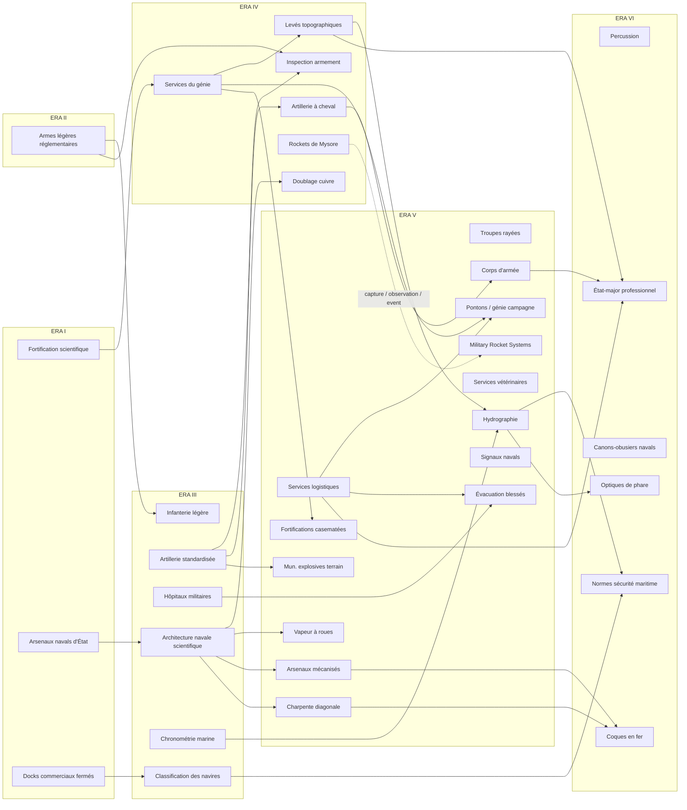

# TECH_MILITARY_NAVAL_1700_1836_V1

## Statut

```text
DOCUMENT = MILITARY_NAVAL_CIVIL_MARITIME_TECH_TREE_RESEARCH_DESIGN
VERSION = V1
SCOPE = 1700–1836
TARGET_ERAS = I–VI_OF_XII
CATEGORY = MILITARY
INCLUDES = LAND + MILITARY_NAVAL + CIVIL_MARITIME
TOTAL_NODES = 36

HISTORICAL_ARCHITECTURE = FROZEN_V1
IMPLEMENTATION_FREEZE = NO
TECH_COSTS = NOT_FROZEN
PM_NUMERIC_BALANCE = NOT_FROZEN
VANILLA_OVERLAP_AUDIT = REQUIRED_AFTER_SOCIETY_V1
GREAT_WAVE_NAVAL_AUDIT = REQUIRED_AFTER_SOCIETY_V1
```

Cette V1 consolide la chronologie et l'architecture historique de la catégorie Military pour 1700–1836. Elle respecte le fait que **Victoria 3 place déjà la marine civile et militaire dans l'arbre Military**. Les noms et concepts marqués `VANILLA_OVERLAP_PENDING_AUDIT` ne signifient pas automatiquement de nouveaux IDs : ils pourront devenir KEEP/RETIME/RENAME/REWIRE/MERGE/SPLIT/REPLACE après l'audit des 179 technologies vanilla.

Le naval est volontairement conçu **sans supposer l'ancien modèle d'unités navales** : The Great Wave / 1.13 a profondément modifié la construction et le design des navires. Les nodes navals V1 décrivent donc des **capacités historiques** (coque, propulsion, armement, chantier, navigation, sécurité) dont l'implémentation exacte sera déterminée par l'audit du Ship Designer.

## Règle canonique — types de technologies

```text
UNIVERSAL
→ recherchable normalement.

UNIVERSAL_STARTING_DIFFERENTIAL
→ universelle, mais certains pays la possèdent déjà en 1700/1776.

REGIONAL_INNOVATION
→ capacité initialement limitée à une région/polité;
  peut ensuite être transférée historiquement.

EVENT_ACQUIRED_UNIVERSAL
→ technologie universelle obtenue par réforme, mission étrangère,
  capture, observation ou transfert plutôt que par recherche normale initiale.

REGIONAL_PM_OR_TRADITION
→ différence trop étroite pour un node complet;
  PM, unité, doctrine ou bonus régional.
```

## Vue au premier coup d'œil

| Ère | Fenêtre | Nodes | Technologies |
|---|---|---:|---|
| I | ~1690–1719 | 3 | **Fortification scientifique et art du siège**<br>**Systèmes d'arsenaux navals d'État**<br>**Docks commerciaux fermés** |
| II | ~1720–1749 | 1 | **Armes légères réglementaires** |
| III | ~1750–1774 | 6 | **Tactiques d'infanterie légère**<br>**Systèmes d'artillerie de campagne standardisés**<br>**Hôpitaux militaires permanents**<br>**Architecture navale scientifique**<br>**Chronométrie marine**<br>**Classification et inspection des navires** |
| IV | ~1775–1799 | 6 | **Standardisation et inspection de l'armement**<br>**Services permanents du génie**<br>**Artillerie à cheval**<br>**Levés topographiques militaires**<br>**Doublage des coques en cuivre**<br>**Fusées mysoréennes à enveloppe métallique** |
| V | ~1800–1824 | 14 | **Troupes équipées de fusils rayés**<br>**Organisation en corps d'armée**<br>**Services permanents d'approvisionnement militaire**<br>**Génie de campagne et trains de pontons**<br>**Munitions explosives de campagne**<br>**Évacuation des blessés du champ de bataille**<br>**Services vétérinaires militaires**<br>**Fortifications casematées**<br>**Levés hydrographiques**<br>**Signaux navals standardisés**<br>**Navigation à vapeur à roues**<br>**Arsenaux navals mécanisés**<br>**Charpente navale diagonale**<br>**Systèmes de fusées militaires standardisés** |
| VI | ~1825–1836 frontier | 6 | **Mise à feu à percussion**<br>**État-major général professionnel**<br>**Canons-obusiers navals**<br>**Normes de sécurité maritime**<br>**Optiques modernes de phare**<br>**Construction de coques en fer** |

## Carte globale simplifiée



---

# Consolidation finale des points litigieux

## 1. Naval Gunnery Reform

**Décision V1 : `PM_ONLY / DESIGNER_COMPONENT_PACKAGE`, pas un node autonome.**

La carronade est une innovation importante de la fin des années 1770, mais elle constitue surtout **un choix d'armement avec compromis** : projectile lourd et puissant à courte portée, mais infériorité face aux long guns si l'adversaire garde la distance. Les sources montrent aussi que l'efficacité dépend fortement de l'entraînement des servants, mais on ne voit pas avant 1836 une rupture universelle suffisamment nette pour justifier une tech supplémentaire entre artillerie standardisée et shell guns.

```text
Standardized Field Artillery / Naval artillery capacity
        │
        ├─► PM/component Long Guns
        ├─► PM/component Carronades
        └─► drill / gunnery practice modifiers
                     ↓
             Naval Shell Guns (Era VI)
```

**Conséquence :** `Naval Gunnery Reform` est retiré de la liste des nodes.

## 2. Regular Cavalry Specialization

**Décision V1 : `REGIONAL_PM_OR_TRADITION`, pas node.**

Hussards, dragons, cavalerie lourde/légère et reconnaissance existent sous des formes variées et parfois beaucoup plus anciennes. Au XVIIIe siècle, les armées européennes spécialisent davantage ces rôles, mais cela se traduit mieux par **PM/unit roles/doctrine** que par une invention universelle.

```text
Cavalry baseline
├─► Light cavalry / hussar role
├─► Heavy shock cavalry
├─► Dragoons
└─► Lancers (regional/adoption PM)
```

`Horse Artillery` est conservé comme node V1 car il représente une **organisation de soutien mobile spécifique**; lors de l'audit du système militaire 1.13 il pourra encore être converti en PM/support unlock.

## 3. Permanent Military Hospitals

**Décision V1 : reste dans Military**, avec croisement Society.

Haslar ouvre aux patients en 1753 et illustre l'émergence de grands hôpitaux militaires/navals permanents. La technologie représente une capacité militaire directe de récupération et de réduction de mortalité; Society pourra fournir un prérequis ou bonus via `Public Medicine / Hospital Administration`.

```text
Society: medical institutions
          ╲
           ╲
Permanent Military Hospitals
          ↓
Battlefield Evacuation
```

## 4. Poudre noire

**Pas de node `Improved Gunpowder`.**

Corning, glazing, proofing, grading et contrôles sont conservés comme **PM/process improvements** dans les industries d'armement et d'artillerie.

## 5. Technologie régionale — cas canonique Mysore

```text
MYS 1776:
Mysorean Iron-Cased Rocketry
        ↓
REGIONAL_INNOVATION
        ↓ capture / observation
British research/development
        ↓
Standardized Military Rocket Systems
        ↓
EVENT_ACQUIRED_UNIVERSAL
        ↓
diffusion possible à d'autres pays
```

Ce mécanisme devient la référence pour les véritables innovations régionales transférables.

---

# Trajectoires régionales — règles V1

| Cas | Classification | Traitement |
|---|---|---|
| **Mysore rockets** | `REGIONAL_INNOVATION` | tech régionale + transfert historique |
| **Japon / Tanegashima** | `UNIVERSAL_STARTING_DIFFERENTIAL` | capacité armes à feu déjà possédée, pas « découverte des firearms » |
| **Qing firearms** | `UNIVERSAL_STARTING_DIFFERENTIAL` | armes à feu/artillerie déjà possédées selon capacités historiques |
| **Qing coastal defense** | `REGIONAL_PM_OR_TRADITION` + futur Ship Designer | designs/doctrine côtière, pas tech ethnique |
| **Ottoman engineering reforms** | `EVENT_ACQUIRED_UNIVERSAL` | écoles/réformes donnent progrès vers naval architecture, hydrographie, génie, artillery |
| **Maratha trained brigades** | `EVENT_ACQUIRED_UNIVERSAL` | officiers/entrepreneurs militaires accélèrent techs universelles |
| **Qajar military reform** | `EVENT_ACQUIRED_UNIVERSAL` | missions/traductions/officiers étrangers → acquisition universelle |
| **Zamburak / camel artillery** | `REGIONAL_PM_OR_TRADITION` | PM/support, pas node |

---

# Croisements avec Production V1.1

| Military node | Production dependency / hook |
|---|---|
| Armament Standardization & Inspection | `Precision Boring`, puis `Precision Machine Tools` |
| Copper Sheathing | futur good `copper` / chaîne cuivre |
| Rifle Troops | `Precision Machine Tools` candidate |
| Battlefield Evacuation | futurs goods medical/pharmaceuticals |
| Military Veterinary Services | livestock/horses + futurs medicines |
| Casemated Fortifications | construction materials; futur `cement` après 1836 |
| Paddle Steam Navigation | `Rotative Steam Power` + `High-Pressure Steam` |
| Mechanized Naval Dockyards | `Precision Machine Tools` + `Rotative Steam Power` |
| Iron Hull Construction | `Puddling & Rolling` + `Precision Machine Tools` |
| Modern Lighthouse Optics | Glassworks / `Pressed Glass` + precision optics |
| Naval provisioning | `Hermetic Food Preservation` comme PM/capacité, **pas nouveau tech naval** |

---

# Croisements Society à réserver

```text
Public Medicine / Hospital Administration
    -> Permanent Military Hospitals
    -> Battlefield Evacuation

Veterinary Science
    -> Military Veterinary Services

Scientific Surveying / Cartography
    -> Military Topographic Surveying
    -> Hydrographic Surveying

Military / Technical Education
    -> Permanent Engineer Services
    -> Professional General Staff
    -> Scientific Naval Architecture

Optics / Experimental Science
    -> Marine Chronometry
    -> Modern Lighthouse Optics

State Capacity / Bureaucracy
    -> Armament inspection
    -> Military supply services
    -> major dockyard systems
```

Ces liens ne sont **pas encore des prérequis définitifs** tant que Society V1 n'existe pas.

---

# Catalogue complet

| Technologie | Ère | Sous-branche | Type | Prérequis | Débloque | Audit requis | Statut |
|---|---:|---|---|---|---|---|---|
| **Fortification scientifique et art du siège**<br>`scientific_fortification_siegecraft` | I | Génie / fortifications | UNIVERSAL_STARTING_DIFFERENTIAL | BASELINE_GUNPOWDER_WARFARE | Fortifications bastionnées; sièges méthodiques; sape; ingénieurs spécialisés | AUDIT_VANILLA_LATER | STRONG_KEEP |
| **Systèmes d'arsenaux navals d'État**<br>`state_dockyard_systems` | I | Naval civil + militaire | UNIVERSAL_STARTING_DIFFERENTIAL | BASELINE_SHIPBUILDING | Dry docks; mast ponds; ropeworks; stores; naval repair/construction capacity | GREAT_WAVE_AUDIT_REQUIRED | STRONG_KEEP |
| **Docks commerciaux fermés**<br>`enclosed_dock_systems` | I | Marine civile / ports | UNIVERSAL | BASELINE_PORTS | Port PM/capacity for enclosed basins, regular loading/unloading, commercial repairs | AUDIT_PORT_PMS_LATER | KEEP |
| **Armes légères réglementaires**<br>`regulated_small_arms` | II | Infanterie / armement | UNIVERSAL | BASELINE_FLINTLOCK_FIREARMS | Regulated musket patterns; standardized calibres; improved small-arms PM | VANILLA_OVERLAP_PENDING_AUDIT | STRONG_KEEP |
| **Tactiques d'infanterie légère**<br>`light_infantry_tactics` | III | Infanterie / doctrine | UNIVERSAL | regulated_small_arms | Skirmish/reconnaissance infantry role; later rifle-specialist PMs | VANILLA_OVERLAP_PENDING_AUDIT_SKIRMISH | KEEP_CONCEPT |
| **Systèmes d'artillerie de campagne standardisés**<br>`standardized_field_artillery` | III | Artillerie | UNIVERSAL | BASELINE_ARTILLERY | Standardized calibres; field artillery systems; caissons; service differentiation; artillery PMs | VANILLA_OVERLAP_PENDING_AUDIT | STRONG_KEEP |
| **Hôpitaux militaires permanents**<br>`permanent_military_hospitals` | III | Médecine militaire | UNIVERSAL | BASELINE_MILITARY_MEDICINE | Military/naval hospital organization; recovery ↑; disease mortality ↓ | VANILLA_OVERLAP_PENDING_AUDIT | STRONG_KEEP |
| **Architecture navale scientifique**<br>`scientific_naval_architecture` | III | Naval civil + militaire | UNIVERSAL | state_dockyard_systems | Calculated hull design; standardized plans; merchant + warship design competence | GREAT_WAVE_AUDIT_REQUIRED | STRONG_KEEP |
| **Chronométrie marine**<br>`marine_chronometry` | III | Navigation civile + militaire | UNIVERSAL | BASELINE_CELESTIAL_NAVIGATION | Longitude at sea capability; navigation accuracy; exploration/commercial/naval range efficiency | VANILLA_OVERLAP_PENDING_AUDIT | STRONG_KEEP |
| **Classification et inspection des navires**<br>`ship_classification_surveying` | III | Marine civile | UNIVERSAL | enclosed_dock_systems | Hull survey/classification; merchant safety/insurance efficiency; ship quality standards | AUDIT_VANILLA_NAVAL_CIVIL | STRONG_KEEP |
| **Standardisation et inspection de l'armement**<br>`armament_standardization_inspection` | IV | Armement / industrie militaire | UNIVERSAL | regulated_small_arms<br> standardized_field_artillery | Gauges; dimensional inspection; harmonized weapon patterns; repairability/quality ↑ | VANILLA_OVERLAP_PENDING_AUDIT | STRONG_KEEP |
| **Services permanents du génie**<br>`permanent_engineer_services` | IV | Génie | UNIVERSAL | scientific_fortification_siegecraft | Engineer support; field fortification; roads/trenches; military works | VANILLA_OVERLAP_PENDING_AUDIT | STRONG_KEEP |
| **Artillerie à cheval**<br>`horse_artillery` | IV | Artillerie / cavalerie | UNIVERSAL | standardized_field_artillery | Mobile artillery support PM; mobility/speed ↑; cost/horse demand ↑ | AUDIT_UNIT_PM_SYSTEM_LATER | KEEP |
| **Levés topographiques militaires**<br>`military_topographic_surveying` | IV | Commandement / génie | UNIVERSAL | permanent_engineer_services | Campaign maps; route planning; reconnaissance; fortification planning | VANILLA_OVERLAP_PENDING_AUDIT | STRONG_KEEP |
| **Doublage des coques en cuivre**<br>`copper_sheathing` | IV | Construction navale | UNIVERSAL | scientific_naval_architecture | Copper-sheathed wooden hull PM/component; fouling ↓; maintenance/range efficiency ↑ | GREAT_WAVE_AUDIT_REQUIRED | STRONG_KEEP |
| **Fusées mysoréennes à enveloppe métallique**<br>`mysorean_iron_cased_rocketry` | IV | Artillerie régionale | REGIONAL_INNOVATION | REGIONAL_MYSORE_MILITARY_TRADITION | Mysorean rocket corps/support; iron-cased rockets; event transfer hooks | NO_VANILLA_DUPLICATE_EXPECTED | STRONG_KEEP_REGIONAL |
| **Troupes équipées de fusils rayés**<br>`rifle_troops` | V | Infanterie | UNIVERSAL | light_infantry_tactics<br> armament_standardization_inspection | Rifle specialist PM/unit role; accuracy/range ↑; reload/cost tradeoff | VANILLA_OVERLAP_PENDING_AUDIT_RIFLING_SKIRMISH | KEEP_CONCEPT |
| **Organisation en corps d'armée**<br>`corps_organization` | V | Commandement | UNIVERSAL | horse_artillery<br> permanent_engineer_services | Combined-arms corps; operational autonomy; command capacity | VANILLA_OVERLAP_PENDING_AUDIT | STRONG_KEEP |
| **Services permanents d'approvisionnement militaire**<br>`military_supply_services` | V | Logistique | UNIVERSAL | BASELINE_SUPPLY_SYSTEMS | Supply trains; ammunition trains; engineer trains; campaign attrition/supply capacity improvements | VANILLA_OVERLAP_PENDING_AUDIT | STRONG_KEEP |
| **Génie de campagne et trains de pontons**<br>`field_engineering_pontoon_trains` | V | Génie | UNIVERSAL | permanent_engineer_services<br> military_supply_services | Bridging; crossings; field works; mobility support | VANILLA_OVERLAP_PENDING_AUDIT | STRONG_KEEP |
| **Munitions explosives de campagne**<br>`explosive_field_ammunition` | V | Artillerie | UNIVERSAL | standardized_field_artillery | Shrapnel/spherical shell field ammunition PMs; anti-personnel/artillery flexibility | VANILLA_OVERLAP_PENDING_AUDIT | KEEP |
| **Évacuation des blessés du champ de bataille**<br>`battlefield_evacuation` | V | Médecine militaire | UNIVERSAL | permanent_military_hospitals<br> military_supply_services | Mobile ambulances; wounded recovery ↑; battlefield mortality ↓ | VANILLA_OVERLAP_PENDING_AUDIT | STRONG_KEEP |
| **Services vétérinaires militaires**<br>`military_veterinary_services` | V | Médecine / cavalerie / logistique | UNIVERSAL | BASELINE_CAVALRY | Horse/mule mortality ↓; remount efficiency ↑; cavalry/artillery/logistics animal losses ↓ | VANILLA_OVERLAP_PENDING_AUDIT | STRONG_KEEP |
| **Fortifications casematées**<br>`casemated_fortifications` | V | Fortifications | UNIVERSAL | permanent_engineer_services | Casemated/coastal forts; concentrated artillery; fort defense PMs | VANILLA_OVERLAP_PENDING_AUDIT | STRONG_KEEP |
| **Levés hydrographiques**<br>`hydrographic_surveying` | V | Navigation civile + militaire | UNIVERSAL | marine_chronometry<br> military_topographic_surveying | Admiralty-style charts; safer navigation; ports/coasts surveyed; naval/commercial efficiency | VANILLA_OVERLAP_PENDING_AUDIT | STRONG_KEEP |
| **Signaux navals standardisés**<br>`standardized_naval_signals` | V | Commandement naval | UNIVERSAL | scientific_naval_architecture | Fleet signal books; coordination/command efficiency | GREAT_WAVE_AUDIT_REQUIRED | KEEP |
| **Navigation à vapeur à roues**<br>`paddle_steam_navigation` | V | Naval civil + militaire | UNIVERSAL | scientific_naval_architecture | Civil steam routes; early naval steam propulsion capability/component | GREAT_WAVE_AUDIT_REQUIRED | STRONG_KEEP |
| **Arsenaux navals mécanisés**<br>`mechanized_naval_dockyards` | V | Construction navale | UNIVERSAL | scientific_naval_architecture<br> state_dockyard_systems | Shipyard productivity; standardized blocks/rigging components; repair efficiency ↑ | GREAT_WAVE_AUDIT_REQUIRED | STRONG_KEEP |
| **Charpente navale diagonale**<br>`diagonal_ship_framing` | V | Construction navale | UNIVERSAL | scientific_naval_architecture<br> copper_sheathing | Stronger/larger wooden hull PM/component; durability ↑ | GREAT_WAVE_AUDIT_REQUIRED | STRONG_KEEP |
| **Systèmes de fusées militaires standardisés**<br>`standardized_military_rockets` | V | Artillerie / transfert technologique | EVENT_ACQUIRED_UNIVERSAL | TRANSFER_FROM_REGIONAL_ROCKET_TECH_OR_EQUIVALENT | Standardized rocket artillery/support PM; incendiary/explosive rocket use | VANILLA_OVERLAP_PENDING_AUDIT | KEEP |
| **Mise à feu à percussion**<br>`percussion_ignition` | VI | Infanterie / armement | UNIVERSAL | armament_standardization_inspection<br> rifle_troops | Early percussion firearms PM; reliability ↑; weather resistance ↑; transition not instant | VANILLA_OVERLAP_PENDING_AUDIT_HIGH | KEEP_CONCEPT |
| **État-major général professionnel**<br>`professional_general_staff` | VI | Commandement | UNIVERSAL | corps_organization<br> military_topographic_surveying<br> military_supply_services | Staff planning; mobilization/coordination; operational planning; command capacity | VANILLA_OVERLAP_PENDING_AUDIT_GENERAL_STAFF | KEEP_CONCEPT |
| **Canons-obusiers navals**<br>`naval_shell_guns` | VI | Artillerie navale | UNIVERSAL | standardized_field_artillery<br> scientific_naval_architecture | Early shell-gun naval armament component/PM; wooden hull lethality ↑ | GREAT_WAVE_AUDIT_REQUIRED | STRONG_KEEP |
| **Normes de sécurité maritime**<br>`maritime_safety_standards` | VI | Marine civile | UNIVERSAL | ship_classification_surveying<br> hydrographic_surveying | Seaworthiness/load standards; merchant loss risk ↓; classification efficiency ↑ | AUDIT_MERCHANT_SHIPPING_SYSTEM | STRONG_KEEP |
| **Optiques modernes de phare**<br>`modern_lighthouse_optics` | VI | Marine civile / navigation | UNIVERSAL | hydrographic_surveying | Fresnel-style lighthouse PM; safer navigation; port/coastal efficiency | VANILLA_OVERLAP_PENDING_AUDIT | STRONG_KEEP |
| **Construction de coques en fer**<br>`iron_hull_construction` | VI | Construction navale | UNIVERSAL | scientific_naval_architecture<br> mechanized_naval_dockyards | Early iron merchant hull component/type; stronger structural designs; new shipyard inputs | GREAT_WAVE_AUDIT_REQUIRED | STRONG_KEEP |

---

# Great Wave — réserve d'implémentation obligatoire

Les nodes navals V1 sont des **capacités historiques**, pas encore des définitions techniques du Ship Designer.

Après Society V1, l'audit 1.13.9 devra vérifier au minimum :

```text
SHIP_DESIGNER
HULLS / SHIP_TYPES
MATERIALS
PROPULSION
WEAPONS
PROTECTION / ARMOR
RANGE / COASTAL_VS_OCEANIC_ROLES
SHIPYARD_BUILD_RULES
CONSTRUCTION_INPUTS
FLAGSHIPS
SHIP_PURCHASE / EXPORT
TECH_UNLOCKS
AI_DESIGN_SELECTION
AI_SHIP_CONSTRUCTION
CIVIL_VS_MILITARY_MARITIME_INTERACTIONS
DLC_VS_FREE_UPDATE_DEPENDENCIES
```

Hypothèses **à ne pas considérer comme implémentation acquise** :

- `Copper Sheathing` pourrait devenir hull PM/component.
- `Paddle Steam Navigation` pourrait débloquer propulsion.
- `Diagonal Ship Framing` pourrait améliorer coque bois.
- `Naval Shell Guns` pourrait débloquer weapon component.
- `Iron Hull Construction` pourrait débloquer matériau/type de coque.
- `Scientific Naval Architecture` pourrait ouvrir des designs/slots/capacités.
- `State/Mechanized Dockyards` pourraient modifier construction/repair.

Tout cela reste `PENDING_GREAT_WAVE_AUDIT`.

---

# Équilibre de densité V1

```text
ERA_I   = 3 nodes
ERA_II  = 1 node
ERA_III = 6 nodes
ERA_IV  = 6 nodes
ERA_V   = 14 nodes
ERA_VI  = 6 nodes

TOTAL = 36
```

La faible densité d'Era II est **volontaire** : nous ne créons pas de faux nodes simplement pour remplir 1720–1749. Beaucoup de capacités militaires sont déjà anciennes en 1700, et la densité d'innovations organisationnelles/industrielles augmente nettement après 1750.

---

# Phase suivante après Society V1

```text
TECH-1A — VANILLA TECHNOLOGY OVERLAP AUDIT

Pour les 179 technologies vanilla :
KEEP
RETIME
RENAME
REWIRE
MERGE
SPLIT
REPLACE
REMOVE

Comparer avec :
Production V1.1
Military V1
Society V1

Puis :

TECH-1B — GREAT WAVE NAVAL SYSTEM AUDIT
```

---

# Sources de consolidation

- https://actualites.musee-armee.fr/expositions/histoires-darmes-episode-10-de-loinlarmement-industrie-pionniere/
- https://www.rmg.co.uk/stories/maritime-history/royal-naval-dockyards
- https://historicengland.org.uk/research/current/discover-and-understand/coastal-and-marine/port-and-harbours/
- https://collection.nam.ac.uk/detail.php?acc=1990-02-55-1
- https://www.nam.ac.uk/explore/seven-years-war
- https://www.musee-armee.fr/collections/explorer-les-collections/portofolios/le-systeme-gribeauval.html
- https://historicengland.org.uk/listing/the-list/list-entry/1001558/
- https://www.rijksmuseum.nl/en/collection/publication/Architectura-Navalis-Mercatoria--0dcd3a5eb0e331c18fe2aa7d5712604b
- https://www.rmg.co.uk/sites/default/files/import/media/pdf/H4.pdf
- https://www.lrfoundation.org.uk/about-us/our-history
- https://www.nationalarchives.gov.uk/help-with-your-research/research-guides/board-ordnance
- https://www.nam.ac.uk/explore/cavalry-roles
- https://www.ordnancesurvey.co.uk/about/history
- https://www.rmg.co.uk/collections/archive/rmgc-object-511162
- https://www.royalartillerymuseum.com/our-collection/congreves-rocket-0
- https://collection.nam.ac.uk/detail.php?acc=1976-11-53--1
- https://www.musee-armee.fr/expoNapoleonStratege/docs/MA-Napoleon-stratege-DPFR.pdf
- https://www.nationalarchives.gov.uk/help-with-your-research/research-guides/british-army-operations-up-to-1913
- https://collection.nam.ac.uk/detail.php?acc=1991-08-125-1
- https://collections.musee-armee.fr/le-recolement-au-service-de-sante-des-armees/
- https://www.nam.ac.uk/explore/royal-army-veterinary-corps
- https://www.govinfo.gov/content/pkg/GOVPUB-D103-PURL-gpo248325/pdf/GOVPUB-D103-PURL-gpo248325.pdf
- https://www.gov.uk/government/publications/corporate-brochure/corporate-brochure
- https://www.rmg.co.uk/collections/archive/rmgc-object-576443
- https://collection.sciencemuseumgroup.org.uk/objects/co8018658/the-original-engine-of-henry-bells-paddle-steamer
- https://historicengland.org.uk/listing/the-list/list-entry/1078288
- https://www.rmg.co.uk/collections/objects/rmgc-object-68492
- https://www.metmuseum.org/art/collection/search/33345
- https://www.marinersmuseum.org/2022/12/the-evolution-of-naval-ordnance-1820-1866/
- https://cordouan.culture.gouv.fr/fr/la-premiere-optique-de-cordouan
- https://www.erih.net/how-it-started/stories-about-people-biographies/biography/manby

## Verdict V1

```text
MILITARY_1700_1836_V1 = COMPLETE
LAND_ARCHITECTURE = FROZEN_V1
MILITARY_NAVAL_ARCHITECTURE = FROZEN_V1
CIVIL_MARITIME_ARCHITECTURE = FROZEN_V1
REGIONAL_TECH_FRAMEWORK = FROZEN_V1

NAVAL_GUNNERY_REFORM = PM_ONLY
REGULAR_CAVALRY_SPECIALIZATION = REGIONAL_PM_OR_TRADITION
PERMANENT_MILITARY_HOSPITALS = MILITARY_NODE_WITH_SOCIETY_CROSSLINK
MYSORE_ROCKETRY = REGIONAL_INNOVATION
STANDARDIZED_MILITARY_ROCKETS = EVENT_ACQUIRED_UNIVERSAL

VANILLA_OVERLAP = PENDING_POST_SOCIETY_AUDIT
GREAT_WAVE_IMPLEMENTATION = PENDING_POST_SOCIETY_AUDIT
TECH_COSTS = NOT_FROZEN
PM_VALUES = NOT_FROZEN
```
