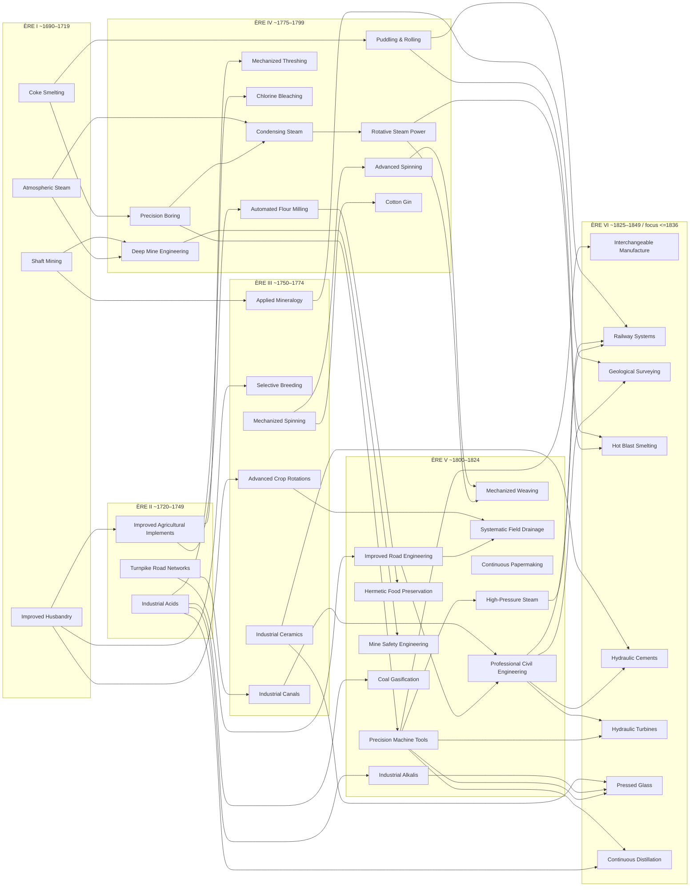
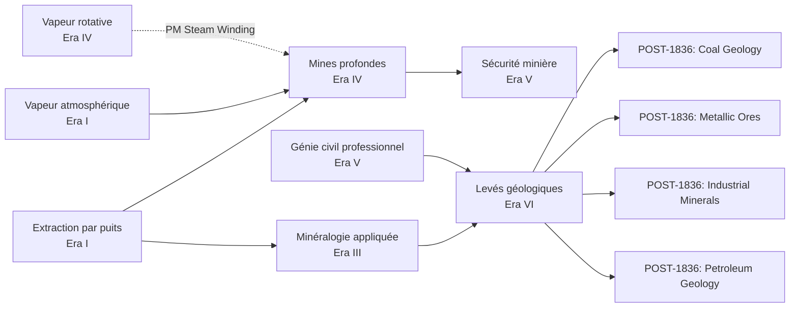
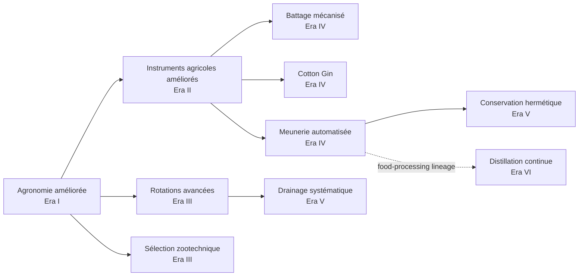
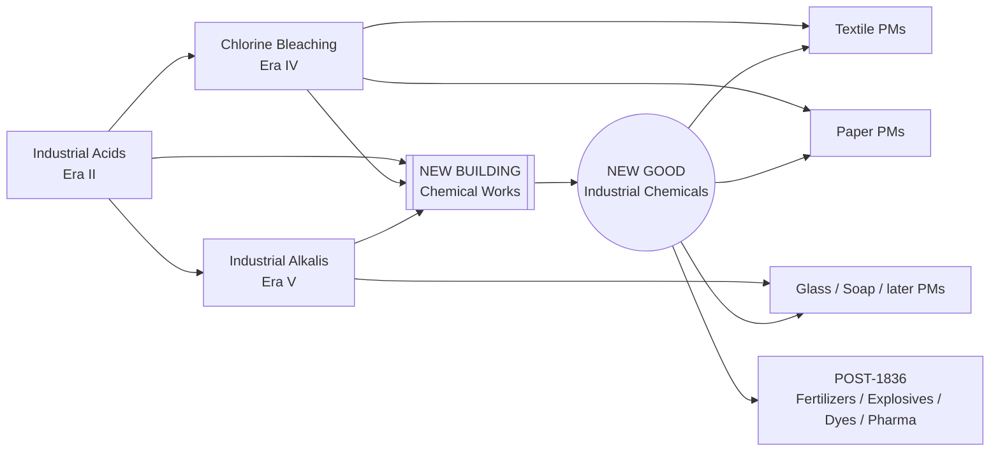
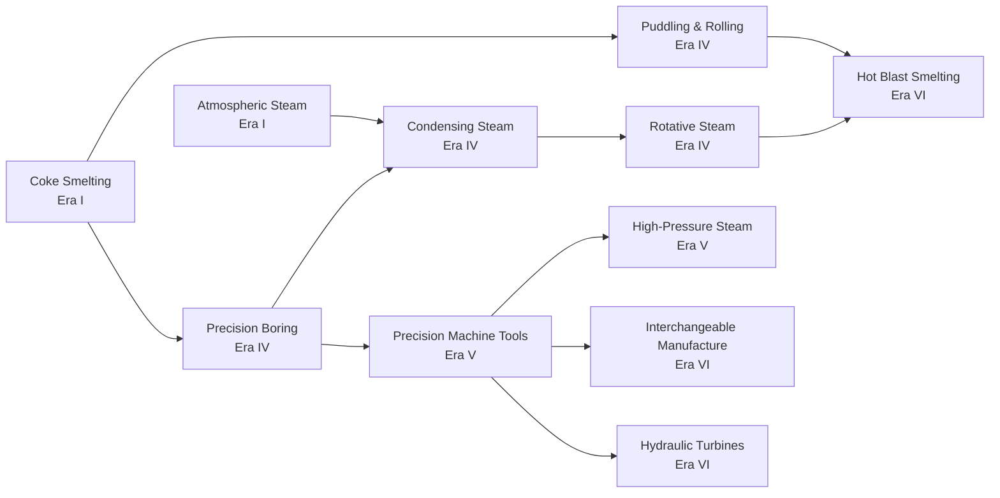
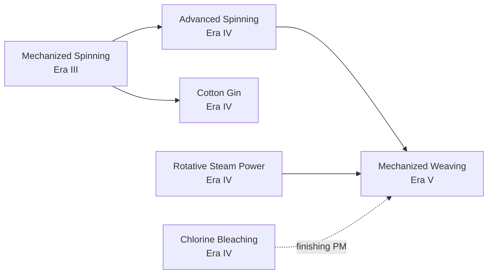
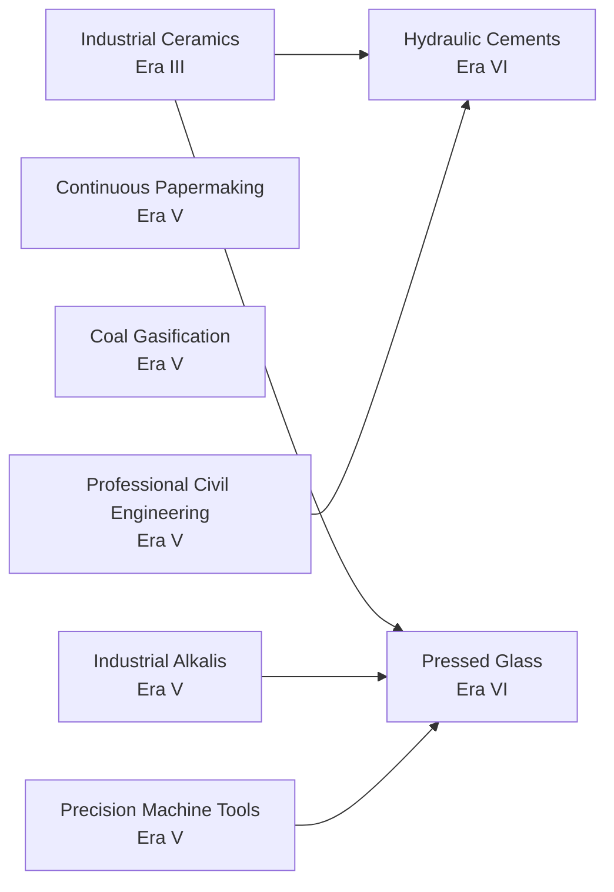
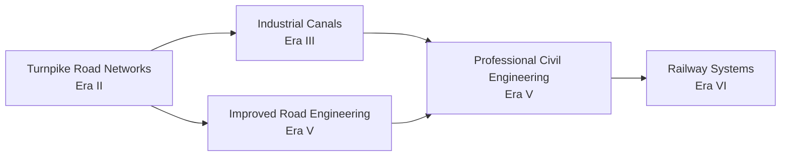

# TECH_PRODUCTION_1700_1836_V1

## Statut

```text
DOCUMENT = PRODUCTION_TECH_TREE_RESEARCH_DESIGN
VERSION = V1.1
SCOPE = 1700–1836
TARGET_ERAS = I–VI_OF_XII
PRODUCTION_NODES = 42
IMPLEMENTATION_FREEZE = NO
HISTORICAL_DESIGN_FREEZE = YES
NUMERIC_PACING_FREEZE = NO
TRANSPORT_GAMEPLAY_FREEZE = NO
```

Cette V1.1 **fige la proposition historique et architecturale amendée** de la branche Production pour 1700–1836 suffisamment pour servir de référence au travail ultérieur. Elle ne fige pas encore les coûts de recherche, les valeurs numériques de PM, les IDs de script définitifs ni la refonte complète du transport.


## Amendements V1.1

```text
SALT
= STRONG_NEW_GOOD_CANDIDATE
= POP_CONSUMPTION_REQUIRED_IF_RETAINED
= CHEMICAL_INPUT
= FOOD_PRESERVATION_INPUT
= AUDIT_LA_GABELLE_BEFORE_IMPLEMENTATION

INDUSTRIAL_CERAMICS
= NO_NEW_BUILDING
= USE_EXISTING_GLASSWORKS
= REWORK_EXISTING_PORCELAIN_PMS
= PORCELAIN_POP_DEMAND_RETAINED

CEMENT
= POST_1836_CANDIDATE
= CONSTRUCTION_PRIMARY_DEMAND
= INFRASTRUCTURE_URBAN_SECONDARY_DEMAND_CANDIDATE
= NO_DIRECT_POP_CONSUMPTION

GOODS_DESIGN_RULE
= ALWAYS_AUDIT_PRODUCTIVE_DEMAND_AND_POP_DEMAND_SEPARATELY
```

Les six premières ères sont volontairement de plus en plus denses : 4 / 3 / 6 / 10 / 11 / 8 nodes. Cette accélération suit la densification réelle des changements techniques. Un pays commençant en 1700 ou 1776 **ne partira pas de zéro** : les technologies initiales seront attribuées plus tard selon ses capacités historiques.

## Légende

- **NODE** : technologie de recherche.
- **PM** : production method débloqué par la technologie.
- **NEW_BUILDING** : nouveau bâtiment prévu.
- **NEW_GOOD** : nouveau bien prévu.
- **CROSS_BRANCH** : dépendance ou débouché à harmoniser avec Military/Naval ou Society.
- **DEFERRED_TRANSPORT_REWORK** : technologie conservée, effets gameplay exacts réservés à la future refonte route/canal/cabotage/rail.
- **POST_1836** : héritier déjà identifié mais hors périmètre V1.

## Vue au premier coup d'œil — par ère

| Ère | Fenêtre | Nodes | Technologies |
|---|---|---:|---|
| I | ~1690–1719 | 4 | **Extraction par puits**<br>**Fonte au coke**<br>**Machines à vapeur atmosphériques**<br>**Agronomie améliorée** |
| II | ~1720–1749 | 3 | **Instruments agricoles améliorés**<br>**Réseaux routiers à péage**<br>**Acides industriels** |
| III | ~1750–1774 | 6 | **Rotations culturales avancées**<br>**Sélection zootechnique**<br>**Canaux industriels**<br>**Filature mécanisée**<br>**Minéralogie appliquée**<br>**Céramique industrielle** |
| IV | ~1775–1799 | 10 | **Alésage de précision**<br>**Machines à vapeur à condensation**<br>**Force motrice à vapeur rotative**<br>**Filature avancée**<br>**Puddlage et laminage**<br>**Ingénierie des mines profondes**<br>**Battage mécanisé**<br>**Blanchiment au chlore**<br>**Égreneuse à coton**<br>**Meunerie automatisée** |
| V | ~1800–1824 | 11 | **Machines-outils de précision**<br>**Vapeur à haute pression**<br>**Tissage mécanisé**<br>**Alcalis industriels**<br>**Conservation hermétique**<br>**Ingénierie routière améliorée**<br>**Drainage agricole systématique**<br>**Ingénierie de sécurité minière**<br>**Fabrication continue du papier**<br>**Gazéification de la houille**<br>**Génie civil professionnel** |
| VI | ~1825–1849 | 8 | **Fabrication interchangeable**<br>**Systèmes ferroviaires**<br>**Levés géologiques**<br>**Haut-fourneau à vent chaud**<br>**Ciments hydrauliques**<br>**Turbines hydrauliques**<br>**Verre pressé**<br>**Distillation continue** |

## Carte globale simplifiée



---

# 1. Mines et géologie



### Ladder de PM miniers retenu

1. **Shaft Mining** : `Shaft Workings`, treuils à chevaux, blasting à poudre selon région/ressource.
2. **Atmospheric Steam Engines** : `Atmospheric Steam Pumping`.
3. **Deep Mine Engineering** : `Deep Shaft Workings`, haulage souterrain; rendement ↑ mais mortalité/risque ↑.
4. **Rotative Steam Power** : `Steam Winding` comme PM/synergie, **pas comme node séparé**.
5. **Mine Safety Engineering** : lampes de sûreté, ventilation, blasting plus sûr; mortalité ↓.
6. **Applied Mineralogy → Geological Surveying** : assayage puis arbre spécialisé par ressources.

Le but est de faire de la mortalité un vrai coût technique : une mine profonde peut produire davantage avant même d'avoir la sécurité correspondante. Victoria 3 modélisant déjà la mortalité, cette asymétrie doit être exploitée.

---

# 2. Agriculture et alimentation



### Décisions importantes

- **Canning** : on réutilise, redate et **développe les PM vanilla des Food Industries** au lieu de créer un bâtiment ou un good `canned_food`. Les groceries restent le bien final consommé par les POPs.
- **Automated Flour Milling** est ajouté : le système d'Oliver Evans rend la branche alimentaire plus riche avant la conserve.
- **Continuous Distillation** est une tech-frontière Era VI pour les PM de liquor.
- **Agricultural buildings** reçoivent de nouveaux PM directement; pas besoin d'un système parallèle.
- **Factory Organization n'est pas un node Production**. La transition petite production → industrie doit émerger des subsistence buildings, des bâtiments urbains, des qualifications, de l'urbanisation et des PM.

---

# 3. Chimie — architecture économique retenue



## Chemical Works

**Déblocage :** `Industrial Acids`.

`Chemical Works` reste un **nouveau bâtiment dédié** : la branche chimique ne doit pas seulement débloquer des PM dans les autres industries. Elle produit elle-même le good large `industrial_chemicals`, ensuite consommé par plusieurs secteurs.

### PM 1 — Lead Chamber Process
- inputs conceptuels : sulfur + coal + tools, éventuellement petit usage de lead;
- output : `industrial_chemicals`;
- pollution : élevée;
- mortalité/conditions de travail : défavorables.

### PM 2 — Bleaching Compounds
Débloqué par `Chlorine Bleaching`.
- augmente la production/utilisation des Industrial Chemicals;
- alimente Textile Mills et Paper Mills.

### PM 3 — Leblanc Process
Débloqué par `Industrial Alkalis`.
- output chemicals supérieur;
- inputs : sulfur + coal + limestone abstraction + **salt si le good est retenu**;
- pollution et déchets : très élevés;
- ouvre des PM aval pour verre, savon/papier et plus tard engrais/explosifs.

### Nouveau good retenu
`industrial_chemicals` = **STRONG KEEP**.

Il doit conserver une demande croissante après 1836 : textile, papier, verre, engrais, explosifs, colorants, pharmacie, caoutchouc, raffinage, etc. **Aucune consommation POP directe n'est prévue pour 1700–1836** : sa demande doit être d'abord productive.

### Sel — candidat renforcé
`salt` = **STRONG CANDIDATE**, pas encore gelé.

Si retenu, le sel ne devra surtout pas être un input mono-usage du procédé Leblanc. Il devra avoir plusieurs débouchés historiquement cohérents :

```text
SALT
├─► consommation directe des POPs
├─► conservation / transformation alimentaire
├─► Chemical Works — Leblanc et chimie ultérieure
└─► fiscalité / lois / institutions historiques possibles
```

**Référence à auditer avant implémentation : `La Gabelle`.**  
L'audit devra porter sur :
- définition du good `salt`;
- consommation POP et `pop needs`;
- bâtiments et PM de production;
- répartition géographique / resource potentials;
- entreprises;
- lois, fiscalité et contenu lié au sel;
- logique IA.

Cette référence est comparative : ses choix ne seront pas copiés automatiquement.

Le sel n'est pas un micro-good artificiel : il a une consommation alimentaire ancienne, des salines/mines réelles, un rôle de conservation et devient un input majeur du procédé Leblanc. Mais son ajout exige une vraie cartographie mondiale des potentiels et une économie de départ cohérente.

---

# 4. Vapeur, métallurgie et machines-outils



### Points de design

- `Screw-Cutting Lathes` est **MERGED** dans `Precision Machine Tools`.
- `Steam Winding` et `Steam Pumping` sont des **PM**, pas des technologies autonomes.
- `Interchangeable Manufacture` représente une capacité encore partielle en 1825–1836, pas déjà la production de masse moderne.
- `Hydraulic Turbines` est ajouté pour empêcher une trajectoire industrielle entièrement charbon/vapeur : Fourneyron fournit un vrai palier hydraulique moderne dès 1827.

---

# 5. Textile



- Water Frame / Spinning Jenny sont regroupés sous `Mechanized Spinning`.
- Crompton Mule reste un second palier `Advanced Spinning`.
- Le Power Loom est placé en Era V pour représenter **l'adoption pratique**, pas seulement le brevet de 1785.
- Le blanchiment chimique devient une dépendance aval optionnelle/PM, sans forcer toute la chaîne textile à être britannique.

---

# 6. Matériaux, papier et utilités urbaines



- `Industrial Ceramics` ne signifie **pas** « découverte de la porcelaine ». **Aucun nouveau bâtiment de céramique n'est prévu en V1.1** : la porcelaine reste produite dans le **Glassworks vanilla**, dans le même bâtiment que le verre. La tech servira à faire progresser/retravailler les **PM de porcelaine existants**. Les États à tradition céramique avancée pourront commencer avec cette capacité ou un équivalent.
- `Hydraulic Cements` est pré-1836; le **vrai Portland Cement industriel** et le possible good `cement` restent post-1836. Si `cement` devient un good, sa **demande primaire sera la construction**; des demandes secondaires pourront venir des infrastructures, ports, voies ferrées et éventuellement de PM urbains/habitat. **Aucune consommation POP directe de ciment n'est prévue.**
- `Pressed Glass` (années 1820) donne enfin un palier pré-1836 crédible aux Glassworks.
- `Continuous Papermaking` modernise Paper Mills.
- `Coal Gasification` ouvre `Gas Streetlights` dans les Urban Centers; aucun good `gas` séparé pour V1.

---

# 7. Transport — réserve gameplay



Ces nodes sont **historiquement conservés**, mais leurs effets ne sont pas figés.

```text
TRANSPORT_GAMEPLAY = DEFERRED_TRANSPORT_REWORK
ROAD_RELEVANCE_AFTER_RAIL = MUST_REMAIN
CANAL_RELEVANCE_AFTER_RAIL = MUST_REMAIN
COASTAL_SHIPPING_ROLE = TO_DESIGN
RAIL = NOT_AUTOMATIC_REPLACEMENT_FOR_ALL_TRANSPORT
```

La future refonte devra empêcher le comportement vanilla où le chemin de fer efface trop facilement la valeur des routes.

---

# Catalogue complet : prerequis → node → déblocage

| Technologie | Ère | Sous-branche | Prérequis | Débloque directement | Ouvre ensuite | Statut |
|---|---:|---|---|---|---|---|
| **Extraction par puits**<br>`shaft_mining` | I | Mines & géologie | BASELINE_PRE_1700 | PM mines souterraines: Shaft Workings; Horse-Gin Winding; Black-Powder Blasting (selon ressource/pays). | applied_mineralogy<br> deep_mine_engineering | STRONG_KEEP |
| **Fonte au coke**<br>`coke_smelting` | I | Métallurgie | BASELINE_IRONWORKING | PM sidérurgie: Coke Blast Furnaces; demande de charbon accrue; pression réduite sur le bois/charbon de bois. | puddling_and_rolling<br> precision_boring | STRONG_KEEP |
| **Machines à vapeur atmosphériques**<br>`atmospheric_steam_engines` | I | Énergie & vapeur | BASELINE_PUMPING_TECHNIQUES | PM mines: Atmospheric Steam Pumping; gros gain de drainage avec forte consommation de charbon. | condensing_steam_engines<br> deep_mine_engineering<br> high_pressure_steam | STRONG_KEEP |
| **Agronomie améliorée**<br>`improved_husbandry` | I | Agriculture | BASELINE_AGRICULTURE | PM agricoles de base améliorés; socle pour rotations, élevage sélectif et outils. | improved_agricultural_implements<br> advanced_crop_rotations<br> selective_breeding | KEEP_NAME_TO_REVIEW |
| **Instruments agricoles améliorés**<br>`improved_agricultural_implements` | II | Agriculture | improved_husbandry | PM fermes: Seed Drills & Improved Ploughs; Horse-Hoe/Row Cultivation; consommation de tools. | mechanized_threshing<br> cotton_gin<br> automated_flour_milling | STRONG_KEEP |
| **Réseaux routiers à péage**<br>`turnpike_road_networks` | II | Transport & génie civil | BASELINE_ROADS | Capacités routières réservées à la future refonte du transport; pas de simple +infrastructure figé maintenant. | industrial_canals<br> improved_road_engineering | STRONG_KEEP |
| **Acides industriels**<br>`industrial_acids` | II | Chimie | BASELINE_PRACTICAL_CHEMISTRY | NEW_BUILDING Chemical Works; NEW_GOOD Industrial Chemicals; PM Lead Chamber Process. Chemical Works devient le bâtiment de base de la chimie lourde. | chlorine_bleaching<br> industrial_alkalis<br> coal_gasification<br> continuous_distillation | STRONG_KEEP |
| **Rotations culturales avancées**<br>`advanced_crop_rotations` | III | Agriculture | improved_husbandry | PM farms: Advanced Crop Rotation; rendement et usage du sol améliorés; synergie élevage/fumure. | systematic_field_drainage | STRONG_KEEP |
| **Sélection zootechnique**<br>`selective_breeding` | III | Agriculture | improved_husbandry | PM livestock ranches: Selective Breeding; viande/laine/fabric selon filière. | — | KEEP |
| **Canaux industriels**<br>`industrial_canals` | III | Transport & génie civil | turnpike_road_networks | Capacités canal/transport à réserver à la refonte; peut ouvrir PM/infrastructure fluviale futurs. | professional_civil_engineering<br> railway_systems | STRONG_KEEP |
| **Filature mécanisée**<br>`mechanized_spinning` | III | Textile | BASELINE_TEXTILE_PRODUCTION | Textile Mills PM: Spinning Jenny / Water Frame; hausse output, tools/energy inputs selon PM. | advanced_spinning<br> cotton_gin | STRONG_KEEP |
| **Minéralogie appliquée**<br>`applied_mineralogy` | III | Mines & géologie | shaft_mining | PM mines: Ore Assaying & Dressing; base pour spécialisations géologiques futures. | geological_surveying | STRONG_KEEP |
| **Céramique industrielle**<br>`industrial_ceramics` | III | Matériaux | BASELINE_CERAMICS | EXISTING_BUILDING Glassworks: progression/rework des PM de porcelaine déjà présents dans le même bâtiment que le verre; aucun nouveau Ceramic Works prévu. Peut améliorer rendement, combustible et/ou inputs des PM porcelaine. | hydraulic_cements<br> pressed_glass | KEEP |
| **Alésage de précision**<br>`precision_boring` | IV | Machines-outils | coke_smelting | PM tooling/engine: Precision Boring Equipment; améliore qualité des cylindres et pièces. | condensing_steam_engines<br> precision_machine_tools | STRONG_KEEP |
| **Machines à vapeur à condensation**<br>`condensing_steam_engines` | IV | Énergie & vapeur | atmospheric_steam_engines<br> precision_boring | PM mines: Condensing Pumping Engines; forte efficacité charbon; base de la vapeur rotative. | rotative_steam_power | STRONG_KEEP |
| **Force motrice à vapeur rotative**<br>`rotative_steam_power` | IV | Énergie & vapeur | condensing_steam_engines | PM de puissance vapeur dans Textile, Paper, Food, Furniture, Chemical Works; Steam Winding PM en combinaison avec Deep Mine Engineering. | mechanized_weaving<br> precision_machine_tools<br> coal_gasification<br> professional_civil_engineering | STRONG_KEEP |
| **Filature avancée**<br>`advanced_spinning` | IV | Textile | mechanized_spinning | Textile Mills PM: Spinning Mule; qualité/output améliorés. | mechanized_weaving | KEEP |
| **Puddlage et laminage**<br>`puddling_and_rolling` | IV | Métallurgie | coke_smelting | PM sidérurgie: Puddling Furnaces; Rolling Mills; output fer de construction accru. | railway_systems<br> hot_blast_smelting | STRONG_KEEP |
| **Ingénierie des mines profondes**<br>`deep_mine_engineering` | IV | Mines & géologie | shaft_mining<br> atmospheric_steam_engines | PM mines: Deep Shaft Workings; Underground Haulage; Steam Winding si Rotative Steam Power connu. | mine_safety_engineering<br> geological_surveying | STRONG_KEEP |
| **Battage mécanisé**<br>`mechanized_threshing` | IV | Agriculture | improved_agricultural_implements | Grain Farms PM: Threshing Machines; labor ↓, tools/energy ↑, output efficiency ↑. | — | STRONG_KEEP |
| **Blanchiment au chlore**<br>`chlorine_bleaching` | IV | Chimie | industrial_acids | Chemical Works PM: Bleaching Powder; Textile/Paper PMs consommant Industrial Chemicals. | industrial_alkalis | STRONG_KEEP |
| **Égreneuse à coton**<br>`cotton_gin` | IV | Agriculture & textile | mechanized_spinning | Cotton Plantation PM: Cotton Gin; output coton ↑, travail d'égrenage ↓. | — | KEEP |
| **Meunerie automatisée**<br>`automated_flour_milling` | IV | Alimentation | improved_agricultural_implements | Food Industries PM: Automated Flour Milling; labour ↓, tools/mechanical inputs ↑, groceries/flour efficiency ↑. | hermetic_food_preservation | STRONG_KEEP |
| **Machines-outils de précision**<br>`precision_machine_tools` | V | Machines-outils | precision_boring | Tooling Workshops PM: Precision Machine Tools; PM package Mechanized Woodworking/Power Saws possible; quality/throughput machinery ↑. | high_pressure_steam<br> interchangeable_manufacture<br> hydraulic_turbines<br> pressed_glass<br> continuous_distillation | STRONG_KEEP |
| **Vapeur à haute pression**<br>`high_pressure_steam` | V | Énergie & vapeur | atmospheric_steam_engines<br> precision_machine_tools | PM Compact High-Pressure Engines; prérequis mobilité/rail; moteurs plus puissants avec risque chaudière accru. | railway_systems | STRONG_KEEP |
| **Tissage mécanisé**<br>`mechanized_weaving` | V | Textile | advanced_spinning<br> rotative_steam_power | Textile Mills PM: Power Looms; output tissu ↑, labour composition modifiée, power/tools inputs ↑. | — | STRONG_KEEP |
| **Alcalis industriels**<br>`industrial_alkalis` | V | Chimie | industrial_acids | Chemical Works PM: Leblanc Process; Industrial Chemicals output ↑; PM aval verre/savon/papier; forte pollution. Salt devient un input fort candidat si le good est retenu. | pressed_glass<br> post-1836 fertilizer/explosives/dyes chemistry | STRONG_KEEP |
| **Conservation hermétique**<br>`hermetic_food_preservation` | V | Alimentation | automated_flour_milling | REUSE/RETIME vanilla Food Industries Canning PM; développer les PM existants plutôt que créer un bâtiment séparé. Possible early Glass Bottling & Tinned Preserves PM; aucun nouveau good canned_food. | POST_1836 mechanized_canning | STRONG_KEEP |
| **Ingénierie routière améliorée**<br>`improved_road_engineering` | V | Transport & génie civil | turnpike_road_networks | Capacités routières avancées réservées à DEFERRED_TRANSPORT_REWORK. | professional_civil_engineering<br> systematic_field_drainage | STRONG_KEEP |
| **Drainage agricole systématique**<br>`systematic_field_drainage` | V | Agriculture | advanced_crop_rotations<br> improved_road_engineering | PM farms adaptés: Systematic Field Drainage; rendement/fiabilité ↑ sur terres humides; coût tools/construction ↑. | POST_1836 industrial_tile_drainage | KEEP |
| **Ingénierie de sécurité minière**<br>`mine_safety_engineering` | V | Mines & géologie | deep_mine_engineering | Mine PM: Safety Lamps & Ventilation; Safer Blasting; mortalité/accidents ↓, coût/tools ↑. | — | STRONG_KEEP |
| **Fabrication continue du papier**<br>`continuous_papermaking` | V | Papier & procédés continus | precision_boring | Paper Mills PM: Fourdrinier Machine; output ↑, labour ↓, tools/power ↑. | — | STRONG_KEEP |
| **Gazéification de la houille**<br>`coal_gasification` | V | Chimie & utilités urbaines | industrial_acids<br> coke_smelting | Urban Center PM: Gas Streetlights; coal input; option Gasworks dédiée à réévaluer plus tard, sans nouveau good gas pour V1. | — | KEEP |
| **Génie civil professionnel**<br>`professional_civil_engineering` | V | Transport & génie civil | industrial_canals<br> improved_road_engineering | Construction/Infrastructure capability; PM Engineered Works candidate; prérequis Railway, Geological Surveying, Hydraulic Cements, Hydraulic Turbines. | railway_systems<br> geological_surveying<br> hydraulic_cements<br> hydraulic_turbines | KEEP_CROSS_BRANCH_REVIEW |
| **Fabrication interchangeable**<br>`interchangeable_manufacture` | VI | Machines-outils | precision_machine_tools | Tooling/arms/selected industry PM: Standardized Parts; economies of scale/throughput. | post-1836 mass_production lineage | KEEP |
| **Systèmes ferroviaires**<br>`railway_systems` | VI | Transport & génie civil | high_pressure_steam<br> puddling_and_rolling<br> professional_civil_engineering | Railway building/system; locomotion/rail PMs; effets précis DEFERRED_TRANSPORT_REWORK. | post-1836 railway_networks<br> telegraph/rail logistics cross-links | STRONG_KEEP |
| **Levés géologiques**<br>`geological_surveying` | VI | Mines & géologie | applied_mineralogy<br> professional_civil_engineering | Ouvre futurs sous-arbres: Coal Geology; Metallic Ores; Industrial Minerals; Petroleum Geology; resource-potential/prospecting mechanics. | post-1836 coal_geology<br> metallic_ore_processing<br> industrial_minerals<br> petroleum_geology<br> phosphate/bauxite/copper specializations | STRONG_KEEP |
| **Haut-fourneau à vent chaud**<br>`hot_blast_smelting` | VI | Métallurgie | puddling_and_rolling<br> rotative_steam_power | Iron/Steel PM: Hot Blast Furnaces; fuel efficiency ↑, output ↑, lower-grade input tolerance candidate. | post-1836 modern_iron_and_steel lineage | STRONG_KEEP |
| **Ciments hydrauliques**<br>`hydraulic_cements` | VI | Matériaux & construction | professional_civil_engineering<br> industrial_ceramics | Construction/ports/canals PM: Hydraulic Cement Mortars; PAS de new good cement avant la tech post-1836 Portland Cement. Prépare une future demande de ciment principalement portée par la construction. | POST_1836 portland_cement | STRONG_KEEP |
| **Turbines hydrauliques**<br>`hydraulic_turbines` | VI | Énergie hydraulique | professional_civil_engineering<br> precision_machine_tools | PM Advanced Water Power/Turbines dans manufactures compatibles; forte efficacité sans charbon, dépendance géographique/hydraulique. | post-1836 modern_hydropower | STRONG_KEEP |
| **Verre pressé**<br>`pressed_glass` | VI | Matériaux | industrial_ceramics<br> industrial_alkalis<br> precision_machine_tools | Glassworks PM: Mechanical Glass Pressing; labour ↓, output glass/luxury glass ↑, tools/coal/chemicals ↑. | — | KEEP |
| **Distillation continue**<br>`continuous_distillation` | VI | Alimentation & chimie | precision_machine_tools<br> industrial_acids | Food Industries PM: Continuous Distillation; liquor output ↑, labour ↓, coal/tools ↑; peut aussi fournir alcohol industriel plus tard. | post-1836 industrial_alcohol/chemical_feedstocks | KEEP |

---

# Éléments explicitement MERGED / PM_ONLY / rejetés

| Élément | Décision V1 | Motif |
|---|---|---|
| Screw-Cutting Lathes | **MERGED** dans Precision Machine Tools | Trop spécifique comme node autonome. |
| Steam Pumping | **PM_ONLY** | Débloqué par Atmospheric/Condensing Steam. |
| Steam Winding | **PM_ONLY** | Débloqué par Rotative Steam + Deep Mine Engineering. |
| Mechanized Woodworking / Steam Sawmills | **PM_PACKAGE**, pas node | Peut être ouvert par Precision Machine Tools + Rotative Steam; Chatham 1812–14 montre la capacité. |
| Factory Organization | **NOT_PRODUCTION_TECH** | Subsistence buildings + urban buildings + PMs + qualifications doivent porter la transition. |
| Integrated Manufactures | **REPRESENTATION**, pas node | Ne pas forcer une chronologie atelier→usine trop linéaire. |
| Enclosure | **LAW / OWNERSHIP / EVENT**, pas tech | Institution foncière, pas invention technique universelle. |
| Mechanical Printing | **SOCIETY/CROSS_BRANCH CANDIDATE** | Koenig 1812/1814 est majeur mais relève surtout information/mass media. |
| Modern Portland Cement | **POST_1836** | Le brevet 1824 ne vaut pas diffusion du clinker moderne. |
| Mechanized Canning | **POST_1836** | Canning précoce conservé en Era V, mécanisation de masse ultérieure. |
| Industrial Tile Drainage | **POST_1836** | Accélération surtout années 1840+. |
| Chemical Fertilizers | **POST_1836** | À brancher ensuite sur Industrial Chemicals. |
| Modern Explosives | **POST_1836** | À brancher ensuite sur Industrial Chemicals. |
| Mechanical Reaping | **POST_1836** | Premières machines proches du cutoff, diffusion significative plus tard. |
| Cement good / Cement Works | **POST_1836 CANDIDATE** | À débloquer avec Portland Cement moderne; demande primaire Construction Sectors, puis infrastructures/ouvrages légitimes; pas de consommation POP directe. |
| Town Gas good | **NOT_RETAINED_V1** | Gas Streetlights peut rester un PM local consommant coal. |
| Canned Food good | **NOT_RETAINED** | Réutiliser groceries et développer les Canning PM vanilla; groceries restent le bien final consommé par les POPs. |

---

# Hooks post-1836 déjà préparés

```text
Geological Surveying
  -> Coal Geology
  -> Metallic Ores
  -> Industrial Minerals
  -> Petroleum Geology
  -> later Phosphate Prospecting
  -> later Bauxite / Aluminium Ore
  -> later Copper specialization where needed

Industrial Chemicals
  -> Fertilizer Chemistry
  -> Modern Explosives
  -> Synthetic Dyes
  -> Pharmaceuticals
  -> Rubber Chemistry
  -> Petroleum Refining / Petrochemistry

Hydraulic Cements
  -> Portland Cement
  -> Cement good / Cement Works candidate
     -> primary demand: Construction
     -> secondary: infrastructure / ports / rail / urban PMs
     -> no direct POP consumption

Hermetic Food Preservation
  -> Mechanized Canning

Systematic Field Drainage
  -> Industrial Tile Drainage

Precision Machine Tools / Interchangeable Manufacture
  -> Standardized Manufacture
  -> Mass Production

Hydraulic Turbines
  -> Modern Hydropower
```

---


# Doctrine de demande des goods et consommation POP

Chaque nouveau good doit être évalué sur **deux axes séparés** :

1. **demande productive** : inputs de bâtiments/PM, construction, infrastructure, armement, etc.;
2. **demande directe des POPs** : uniquement lorsque le bien correspond réellement à un besoin final.

Le but est d'éviter les chaînes mortes où un good n'a qu'un seul consommateur, tout en évitant aussi d'inventer une consommation POP artificielle.

| Good | Statut | Demande productive | Consommation POP directe | Décision V1.1 |
|---|---|---|---|---|
| `industrial_chemicals` | NEW_GOOD_STRONG_KEEP | chimie, textile, papier, verre; plus tard engrais/explosifs/colorants/pharma/etc. | **NON** en 1700–1836 | Good industriel large |
| `salt` | NEW_GOOD_STRONG_CANDIDATE | conservation alimentaire, Leblanc/chimie, usages futurs | **OUI** si retenu | Auditer `La Gabelle` + répartition mondiale avant gel |
| `porcelain` | EXISTING_VANILLA_GOOD | PM Glassworks / éventuels inputs de finition | **OUI**, conserver vanilla | Pas de nouveau bâtiment céramique |
| `groceries` | EXISTING_VANILLA_GOOD | Food Industries | **OUI** | Canning reste un PM, pas un nouveau good |
| `cement` | POST_1836_CANDIDATE | **construction d'abord**, puis infrastructures/ouvrages/PM urbains légitimes | **NON** | Ne pas forcer un besoin POP de ciment |
| `glass` | EXISTING_VANILLA_GOOD | construction/industries/PM selon vanilla et rework | selon économie vanilla | Conserver une demande mixte |
| futurs `pharmaceuticals` | FUTURE_CANDIDATE | santé/industrie | **OUI probable** | À traiter dans les ères ultérieures |

### Règle de conception

```text
NEW_GOOD
   │
   ├─► au moins une chaîne productive historiquement justifiée
   │
   ├─► plusieurs débouchés à long terme si possible
   │
   └─► POP consumption ONLY IF it is genuinely a final household good
```


---

# IA : règles de conception à conserver

1. **Chaque tech researchable doit recevoir un `ai_weight` explicite.**
2. Les techs ressources doivent être conditionnées : Cotton Gin ↔ coton; mine techs ↔ mines/potentiels; glass ↔ Glassworks; chemistry ↔ demande chemicals.
3. `Chemical Works` exige un **bootstrap économique natif** : l'IA doit anticiper la demande future et ne pas rester bloquée dans une boucle « pas de chemicals parce qu'aucune usine / aucune usine parce que pas de demande ».
4. Les PM dangereux doivent rester économiquement rationnels : une IA pauvre peut accepter Deep Mine output avant sécurité, mais doit valoriser Mine Safety quand mortalité/accidents deviennent coûteux.
5. Les futurs transports devront comparer route/canal/rail selon coût, géographie et volume plutôt que choisir systématiquement le rail.
6. `Hydraulic Turbines` doit recevoir un poids plus élevé dans les pays disposant de bon potentiel hydraulique et peu de charbon.

---

# Notes de pacing

- Cette V1 contient **42 nodes Production** avant/à la frontière de 1836.
- Ce nombre ne signifie pas qu'un pays de 1700 doit les rechercher tous depuis zéro.
- Les pays historiques recevront ultérieurement des **starting technologies différenciées**.
- Le coût exact par ère sera décidé seulement après les branches Military/Naval et Society et après le mécanisme de recherche/Industrial Knowledge Loop.
- Les eras I–II restent volontairement moins denses; l'accélération technique devient très visible à partir des eras IV–VI.

---

# Sources historiques utilisées

- https://historicengland.org.uk/listing/the-list/list-entry/1016755
- https://www.ironbridge.org.uk/about-us/key-figures-in-the-history-of-the-ironbridge-gorge/
- https://collection.sciencemuseumgroup.org.uk/objects/co50900/newcomen-atmospheric-engine
- https://www.cambridge.org/core/books/abs/agricultural-revolution-in-england/agricultural-revolution-reconsidered/C86519B90B0D380E6E804189D4AECE53
- https://collection.sciencemuseumgroup.org.uk/objects/co39077/14-scale-model-of-jethro-tulls-seed-drill
- https://historicengland.org.uk/images-books/publications/dssg-transport-sites/heag254-transport-sites-ssg/
- https://www.erih.net/how-it-started/stories-about-people-biographies/biography/roebuck
- https://www.erih.net/how-it-started/themeroute/chemistry
- https://en.wikisource.org/wiki/1911_Encyclop%C3%A6dia_Britannica/Bakewell%2C_Robert_%28agriculturist%29
- https://canalrivertrust.org.uk/things-to-do/canal-history/canal-pioneers/james-brindley
- https://www.nationalarchives.gov.uk/education/resources/georgian-britain-age-modernity/arkwrights-spinning-frame/
- https://whc.unesco.org/en/list/1030/
- https://whc.unesco.org/archive/advisory_body_evaluation/618.pdf
- https://historicengland.org.uk/content/docs/education/explorer/teachers-kit-pottery-industry-pdf/
- https://historicengland.org.uk/images-books/publications/dssg-industrial-sites/heag246-industrial-sites-ssg/
- https://collection.sciencemuseumgroup.org.uk/objects/co46448/cast-iron-boring-bar-and-boring-head
- https://collection.sciencemuseumgroup.org.uk/objects/co50948/rotative-steam-engine-by-boulton-and-watt-1788
- https://collection.sciencemuseumgroup.org.uk/objects/co44837
- https://collection.sciencemuseumgroup.org.uk/objects/co38693/threshing-machine-built-by-rg-garvie-and-son
- https://www.erih.net/how-it-started/stories-about-people-biographies/biography/tennant
- https://americanhistory.si.edu/collections/object/nmah_625483
- https://home.nps.gov/people/oliver-evans.htm
- https://home.nps.gov/rocr/learn/historyculture/peirce-mill-history.htm
- https://collection.sciencemuseumgroup.org.uk/objects/co46284/henry-maudslays-original-screw-cutting-lathe-c1800-lathes
- https://collection.sciencemuseumgroup.org.uk/objects/co51033/trevithicks-high-pressure-steam-engine-and-boiler-c-1806
- https://collection.sciencemuseumgroup.org.uk/people/ap13666/cartwright-edmund
- https://www.sciencehistory.org/stories/magazine/making-the-process/
- https://www.erih.net/how-it-started/stories-about-people-biographies/biography/leblanc
- https://www.erih.net/how-it-started/history-of-industries/salt
- https://www.nal.usda.gov/exhibits/ipd/canning/timeline-table
- https://www.nps.gov/articles/000/why-no-cans.htm
- https://www.ice.org.uk/what-is-civil-engineering/infrastructure-projects/telfords-roads
- https://www.bahs.org.uk/AGHR/VOLUMES/AGHR34.pdf
- https://www.cambridge.org/core/books/underdraining-of-farmland-in-england-during-the-nineteenth-century/E1E7D39E132FCD3D5F810346F7799BCE
- https://www.rigb.org/explore-science/explore/collection/humphry-davys-miners-safety-lamp
- https://paper.gatech.edu/advent-paper-machine
- https://collection.sciencemuseumgroup.org.uk/objects/co160267/model-of-continuous-paper-making-machine
- https://collection.sciencemuseumgroup.org.uk/people/ap26609/gas-light-and-coke-company
- https://www.ice.org.uk/about-us/our-organisation/history
- https://www.ice.org.uk/what-is-civil-engineering/meet-the-engineers/thomas-telford
- https://collection.sciencemuseumgroup.org.uk/objects/co46697/original-coaking-machine-installed-at-portsmouth
- https://historicengland.org.uk/listing/the-list/list-entry/1078288
- https://collection.sciencemuseumgroup.org.uk/objects/co205767/steam-locomotive-no-1-locomotion-stockton-darlington-railway
- https://www.locomotion.org.uk/whats-on/locomotion-no1
- https://www.bgs.ac.uk/information-hub/bgs-maps-portal/geological-survey-historical-notes/
- https://www.bgs.ac.uk/about-bgs/our-work/our-history/
- https://www.hmsjournal.org/index.php/home/article/view/124
- https://historicengland.org.uk/listing/the-list/list-entry/1004227
- https://historicengland.org.uk/education/training-skills/training/webinars/recordings/webinar-on-mortars-for-conservation-part-1-history-and-materials/
- https://collection.sciencemuseumgroup.org.uk/objects/co50825/fourneyron-turbine-1837
- https://repository.si.edu/bitstream/handle/10088/10218/1/USNMB_1731939_unit.pdf
- https://info.cmog.org/publication/pressed-glass-1825-1925
- https://www.metmuseum.org/art/collection/search/1503
- https://scotchwhisky.com/magazine/whisky-heroes/20740/aeneas-coffey/

## Réserve méthodologique

Les dates indiquent des jalons de développement/adoption et ne signifient pas une diffusion mondiale instantanée. Pour les technologies déjà anciennes dans certaines régions — agriculture, céramique, hydraulique, mines, textile — les futurs setups 1700/1776 devront attribuer les technologies selon les capacités historiques réelles plutôt que selon un récit européen linéaire.

---

# Change log V1.1

- Ajout d'une doctrine explicite de **consommation POP vs demande productive** pour tous les nouveaux goods.
- `salt` passe de simple candidat chimique à **STRONG_NEW_GOOD_CANDIDATE** avec consommation POP directe prévue si retenu.
- Ajout de `La Gabelle` comme **référence de mod à auditer**, sans importer ses choix automatiquement.
- `Industrial Ceramics` est corrigé pour utiliser le **Glassworks vanilla et ses PM de porcelaine**, sans nouveau bâtiment céramique.
- `cement` est cadré comme good post-1836 à **demande d'abord constructive/infrastructurelle**, sans consommation POP directe.
- Les PM vanilla de **Canning** sont explicitement réutilisés et développés; aucun `canned_food` séparé.
