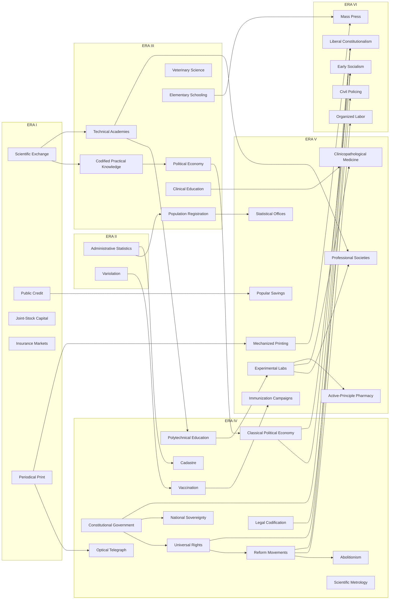

# TECH_SOCIETY_1700_1836_V1

## Statut

```text
DOCUMENT = SOCIETY_TECH_TREE_RESEARCH_DESIGN
VERSION = V1
SCOPE = 1700–1836
TARGET_ERAS = I–VI_OF_XII
CATEGORY = SOCIETY
TOTAL_NODES = 39

S1_FINANCE_COMMERCE = COMPLETE
S2_STATE_ADMINISTRATION = COMPLETE
S3_SCIENCE_EDUCATION_PROFESSIONS = COMPLETE
S4_MEDICINE_PUBLIC_HEALTH = COMPLETE
S5_INFORMATION_MEDIA = COMPLETE
S6_POLITICAL_THOUGHT_SOCIAL_MOVEMENTS = COMPLETE

HISTORICAL_ARCHITECTURE = FROZEN_V1
TECH_COSTS = NOT_FROZEN
NUMERIC_BALANCE = NOT_FROZEN
STARTING_TECH_ASSIGNMENTS = LATER_PHASE
LAW_IMPLEMENTATION = LATER_PHASE
VANILLA_OVERLAP_AUDIT = NEXT_MAJOR_AUDIT
```

Cette V1 remplace `TECH_SOCIETY_1700_1836_V0_1`.  
La V0.1 reste un jalon historique; elle ne doit pas être écrasée silencieusement.

La branche Society n'est pas une échelle de « modernité occidentale ». Elle modélise des **capacités institutionnelles, réseaux de savoir, moyens d'information, formes de mobilisation et doctrines politiques** qui peuvent avoir des trajectoires régionales différentes et être déjà possédées par certains États au setup.

## Règles canoniques

```text
UNIVERSAL
→ recherchable normalement.

UNIVERSAL_STARTING_DIFFERENTIAL
→ universelle, mais déjà acquise par certains États/régions.

EVENT_ACQUIRED_UNIVERSAL
→ capacité universelle acquise par contact, réforme, traduction, mission,
  correspondance, événement ou autre transfert historique.

REGIONAL_INNOVATION
→ innovation réellement circonscrite au départ; diffusion ensuite possible.

REGIONAL_LEGACY_KNOWLEDGE
→ savoir régional plus ancien, souvent utilisé comme antécédent/input.

PM / LAW / INSTITUTION
→ ne pas créer un node quand la différence est une méthode, une politique
  ou une forme d'organisation plutôt qu'une rupture technologique.
```

## Vue globale par ère

| Ère | Fenêtre | Nodes | Technologies |
|---|---|---:|---|
| I | ~1690–1719 | 5 | `institutionalized_scientific_exchange` — Échanges scientifiques institutionnalisés<br>`institutionalized_public_credit` — Crédit public institutionnalisé<br>`joint_stock_capital_markets` — Marchés de capitaux par actions<br>`commercial_insurance_markets` — Marchés d'assurance commerciale<br>`periodical_print_networks` — Réseaux d'imprimés périodiques |
| II | ~1720–1749 | 2 | `systematic_administrative_statistics` — Statistique administrative systématique<br>`variolation_networks` — Réseaux de variolisation |
| III | ~1750–1774 | 7 | `codified_practical_knowledge` — Savoirs pratiques codifiés et encyclopédiques<br>`political_economy` — Économie politique<br>`specialized_technical_academies` — Académies techniques spécialisées<br>`veterinary_science` — Science vétérinaire<br>`organized_elementary_schooling` — Scolarisation élémentaire organisée<br>`systematic_population_registration` — Enregistrement systématique de la population<br>`clinical_medical_education` — Enseignement médical clinique |
| IV | ~1775–1799 | 12 | `classical_political_economy` — Économie politique classique<br>`constitutional_government` — Gouvernement constitutionnel<br>`universal_rights_discourse` — Discours des droits universels et de la citoyenneté<br>`national_sovereignty` — Souveraineté nationale et populaire<br>`organized_reform_movements` — Mouvements de réforme organisés<br>`abolitionist_mobilization` — Mobilisation abolitionniste<br>`systematic_cadastral_surveying` — Levés cadastraux systématiques<br>`systematic_legal_codification` — Codification juridique systématique<br>`scientific_metrology` — Métrologie scientifique<br>`vaccination` — Vaccination<br>`polytechnical_education` — Enseignement polytechnique<br>`optical_telegraph_networks` — Réseaux de télégraphe optique |
| V | ~1800–1824 | 8 | `central_statistical_offices` — Bureaux statistiques centraux<br>`organized_immunization_campaigns` — Campagnes organisées d'immunisation<br>`mechanized_printing` — Imprimerie mécanisée<br>`experimental_research_laboratories` — Laboratoires de recherche expérimentale<br>`specialized_professional_societies` — Sociétés professionnelles spécialisées<br>`clinicopathological_medicine` — Médecine clinico-pathologique<br>`active_principle_pharmacy` — Pharmacie des principes actifs<br>`popular_savings_institutions` — Institutions d'épargne populaire |
| VI | ~1825–1836 frontier | 5 | `professional_civil_policing` — Police civile professionnelle<br>`mass_circulation_press` — Presse à grande diffusion<br>`liberal_constitutionalism` — Constitutionnalisme libéral<br>`organized_labor_movements` — Mouvements ouvriers organisés<br>`early_socialism_cooperativism` — Socialismes précoces et coopérativisme |

# Graphe global simplifié



# S6 — Politique et mouvements sociaux : consolidation finale

## 1. Constitutionnalisme

`Constitutional Sovereignty` de la V0.1 devient **`Constitutional Government`**.

Le node représente la capacité à formaliser par une constitution écrite la structure de l'État, la distribution des pouvoirs et des mécanismes représentatifs. Il ne signifie ni démocratie intégrale ni république obligatoire.

```text
older charters / estates / republics / parliaments
                  ↓
        Constitutional Government
                  ↓
        ├─► government-law hooks
        ├─► separation of powers
        └─► rights / sovereignty branches
```

## 2. Droits et citoyenneté

`Rights of Citizenship` est élargi en **`Universal Rights & Citizenship Discourse`**.

La Déclaration française de 1789 affirme liberté, propriété, sûreté, égalité juridique et séparation des pouvoirs, mais les limites concrètes de ces prétentions sont immédiatement contestées. La Déclaration des droits de la femme et de la citoyenne d'Olympe de Gouges (1791) et *A Vindication of the Rights of Woman* de Wollstonecraft (1792) montrent que les exclusions de genre sont déjà discutées à l'intérieur même de cette période.

```text
Universal Rights & Citizenship Discourse
        ├─► civil-rights law hooks
        ├─► abolitionist claims
        ├─► women's-rights advocacy package
        └─► liberal constitutionalism later
```

**Women's Rights Advocacy = MOVEMENT/IDEA PACKAGE, pas core node pré-1836.**  
La future technologie/mouvement de féminisme de masse reste postérieure.

## 3. Souveraineté nationale

`National Sovereignty` est conservé mais explicitement défini comme **souveraineté nationale/populaire**, et non comme `Nationalism`.

```text
National & Popular Sovereignty
        ↓
independence / unification / citizen legitimacy hooks

POST-1836
        ↓
mass nationalism / national mass politics
```

Les indépendances latino-américaines et haïtiennes doivent être des **trajectoires régionales, révolutionnaires et événementielles**, pas un bouton universel « anti-colonialism ».

## 4. Abolitionnisme

`Abolitionist Mobilization` est **RETIME de l'Ère V vers l'Ère IV**.

La campagne britannique organisée est déjà constituée dans les années 1780, tandis que la révolution de Saint-Domingue à partir de 1791 démontre qu'une histoire mondiale de l'abolition ne peut pas être réduite à la philanthropie britannique : l'émancipation révolutionnaire des esclaves puis l'indépendance haïtienne relèvent d'une agency noire propre.

La tech/mouvement :
- augmente la capacité d'organisation antiesclavagiste;
- ouvre/renforce les pressions sur les lois de traite et d'esclavage;
- **n'abolit pas automatiquement l'esclavage**.

## 5. Libéralisme

Les deux anciens candidats de V0.1 :

```text
Classical Liberal Reform
Liberal Constitutionalism
```

sont **fusionnés**.

Le node final est :

```text
Liberal Constitutionalism
ERA VI
```

Il représente le programme de réforme du premier XIXe siècle associant de façon variable représentation constitutionnelle, droits civils et réformes économiques. Les combinaisons exactes restent déterminées par les lois, les IG et les mouvements.

## 6. Organisation ouvrière

`Organized Labor` devient **`Organized Labor Movements`** et reste Era VI.

Les associations ouvrières et combinaisons existent avant 1824. Les débats parlementaires britanniques de 1824–25 montrent déjà des structures de délégués, fonds, grèves et coordination entre métiers. La tech représente donc une **capacité sociale d'organisation**, pas l'autorisation légale de créer un syndicat.

```text
Organized Labor Movements
        +
labor law

→ legal unionism
or
→ clandestine/repressed combinations
```

`Mass-Circulation Press` n'est plus un prérequis obligatoire : les combinaisons ouvrières lui sont antérieures.

## 7. Socialismes précoces

`Utopian Socialism` devient **`Early Socialism & Cooperativism`**.

Le nouveau nom évite de faire d'une catégorie critique postérieure le nom universel de la technologie. Owen, Saint-Simon et Fourier fournissent des trajectoires distinctes de critique de la société concurrentielle et de projets coopératifs/communautaires.

```text
Organized Reform Movements
        +
Classical Political Economy
        +
industrial social change
              ↓
Early Socialism & Cooperativism
              ↓
POST-1836: socialism / labor mass politics
```

# Décisions non-node consolidées S1–S6

| Concept | Décision V1 |
|---|---|
| Bureaucracy | **REJECT AS NEW TECH** — capacité ancienne |
| Central Banking / Bank of Issue | **LAW / INSTITUTION / VANILLA AUDIT** |
| Banknotes | **PM/INSTITUTION**, pas node |
| Stock Exchange | **MERGE** dans Joint-Stock Capital Markets |
| Postal Service | **INSTITUTION**, pas tech |
| Mail Coaches | **PM_ONLY** |
| Professional Civil Service | **POST-1836** |
| Income Tax | **LAW_UNLOCK**, pas tech |
| Metric System | **REFORM IMPLEMENTATION** de Scientific Metrology |
| Napoleonic Cadastre | **REFORM IMPLEMENTATION** de Cadastral Surveying |
| Patent System | **LAW / INSTITUTION**, pas tech |
| Monitorial Schooling | **PM_ONLY** |
| Anatomy / Surgery / Obstetrics | **PM / professional specialization** sous Clinical Medical Education |
| Pharmacopoeial Standardization | **STARTING / institution / PM** |
| Quarantine | **PRE-1700 institution** |
| Moral Treatment | **PM / institution** |
| Epidemic Investigation | **ERA VI FRONTIER event/institution**, pas core node |
| Sanitary Public Health | **POST-1836** |
| Germ Theory / Bacteriology / Antisepsis | **POST-1836** |
| Lithography | **PM_ONLY** |
| News Agencies | **ERA VI FRONTIER institution**, core post-1836 avec télégraphe |
| Freedom of the Press | **LAW**, pas tech |
| Censorship | **LAW / institution** |
| Women's Rights Advocacy | **MOVEMENT/IDEA PACKAGE** sous Universal Rights; mass feminism post-1836 |
| Republicanism | **OLDER POLITICAL TRADITION / law**, pas tech |
| Democracy | **LAW / VANILLA OVERLAP**, pas nouveau node |
| Anti-Colonialism | **REGIONAL/EVENT MOVEMENT PATH**, pas node universel |
| Nationalism | **POST-1836 mass-development hook / VANILLA AUDIT** |

# Transferts et trajectoires régionales

## Variolisation

```text
older African / Asian / Ottoman practices
             ↓
observation / correspondence
             ↓
Variolation Networks elsewhere
```

## Rangaku

```text
Japan
Dutch-language contact / translation
             ↓
regional knowledge-transfer path
             ↓
medicine / astronomy / optics / geography / artillery / navigation
```

Pas de tech `Western Science`.

## Ottoman technical reforms

```text
Mühendishane and reform institutions
             ↓
progress/acquisition toward universal nodes:
Specialized Technical Academies
Scientific Naval Architecture [Military]
Hydrographic Surveying [Military]
Engineer Services [Military]
```

## Qing

Qing peut commencer avec des niveaux élevés sur certaines capacités de :
- administration;
- population registration;
- legal codification;
- astronomy/court science;

sans nécessairement posséder les mêmes niveaux sur :
- polytechnical education;
- experimental laboratories;
- particular industrial research systems.

## Haïti / Amériques

La révolution haïtienne et les indépendances américaines/latino-américaines doivent pouvoir combiner :

```text
Constitutional Government
Universal Rights Discourse
National Sovereignty
regional revolutionary conditions
slavery / colonial structure
             ↓
unique independence / emancipation paths
```

# Cross-links Production V1.1

| Society | Production |
|---|---|
| Institutionalized Scientific Exchange | tech spread / Industrial Knowledge Loop |
| Specialized Technical Academies | Applied Mineralogy, Civil Engineering, Chemical Works |
| Polytechnical Education | precision engineering, chemistry, geology |
| Scientific Metrology | Precision Machine Tools, Geological Surveying |
| Cadastral Surveying | Geological Surveying / agricultural planning |
| Experimental Research Laboratories | **Research Centers / Industrial Knowledge Loop** |
| Active-Principle Pharmacy | Industrial Chemicals → future Pharmaceuticals |
| Mechanized Printing | Precision Machine Tools + Rotative Steam + Continuous Papermaking |
| Veterinary Science | Selective Breeding / livestock |
| Finance nodes | Companies / private investment / construction |

# Cross-links Military V1

| Society | Military |
|---|---|
| Specialized Technical Academies | Scientific Naval Architecture; Engineer Services |
| Polytechnical Education | Engineers; General Staff education; naval science |
| Veterinary Science | Military Veterinary Services |
| Clinical Medical Education | Permanent Military Hospitals |
| Population Registration | mobilization/manpower information |
| Administrative Statistics | Military Topographic Surveying |
| Optical Telegraph Networks | command / mobilization / strategic communication |
| National Sovereignty | citizen/independence-war mobilization hooks |
| Public Credit | war finance |
| Organized Immunization | military population health |

# Industrial Knowledge Loop — ancrage Society V1

```text
UNIVERSITIES
    ↓
education / academics / fundamental research

Institutionalized Scientific Exchange
    ↓
knowledge circulation

Specialized Technical Academies
    ↓
technical qualifications

Polytechnical Education
    ↓
advanced applied science

Experimental Research Laboratories
    ↓
RESEARCH CENTERS
    ↑
industrial knowledge / technical records
    ↑
PRODUCTION BUILDINGS
```

Le mécanisme exact de good `technical knowledge/data`, de tradabilité et de production/consommation reste **NON FROZEN**.  
Mais son **ancrage historique dans l'arbre est désormais gelé V1**.

# Catalogue complet

| Technologie | Ère | Sous-branche | Type | Prérequis | Débloque | Audit vanilla | Statut |
|---|---:|---|---|---|---|---|---|
| **Échanges scientifiques institutionnalisés**<br>`institutionalized_scientific_exchange` | I | Science / connaissance | UNIVERSAL_STARTING_DIFFERENTIAL | BASELINE_LITERACY_AND_KNOWLEDGE_NETWORKS | Correspondance savante<br> publications<br> traduction<br> circulation internationale des observations<br> tech spread | VANILLA_OVERLAP_PENDING_AUDIT | STRONG_KEEP |
| **Crédit public institutionnalisé**<br>`institutionalized_public_credit` | I | Finance / État | UNIVERSAL_STARTING_DIFFERENTIAL | BASELINE_FISCAL_ADMINISTRATION | Dette publique structurée<br> emprunts de long terme<br> financement de guerre<br> intermédiaires financiers<br> bank-of-issue reform hooks | VANILLA_OVERLAP_PENDING_AUDIT | STRONG_KEEP |
| **Marchés de capitaux par actions**<br>`joint_stock_capital_markets` | I | Finance / commerce | UNIVERSAL_STARTING_DIFFERENTIAL | BASELINE_LONG_DISTANCE_COMMERCE | Actions transférables<br> sociétés par actions<br> capital privé mutualisé<br> securities-market hooks | VANILLA_OVERLAP_PENDING_AUDIT_HIGH | KEEP_CONCEPT |
| **Marchés d'assurance commerciale**<br>`commercial_insurance_markets` | I | Finance / commerce | UNIVERSAL_STARTING_DIFFERENTIAL | BASELINE_LONG_DISTANCE_COMMERCE | Underwriting<br> mutualisation du risque<br> intelligence maritime<br> trade-risk reduction | VANILLA_OVERLAP_PENDING_AUDIT | STRONG_KEEP |
| **Réseaux d'imprimés périodiques**<br>`periodical_print_networks` | I | Information / médias | UNIVERSAL_STARTING_DIFFERENTIAL | BASELINE_PRINT_CULTURE | Gazettes<br> journaux<br> revues<br> périodiques savants<br> circulation régulière des nouvelles | VANILLA_OVERLAP_PENDING_AUDIT | STRONG_KEEP |
| **Statistique administrative systématique**<br>`systematic_administrative_statistics` | II | Administration / information | UNIVERSAL_STARTING_DIFFERENTIAL | BASELINE_BUREAUCRATIC_RECORDS | Rapports standardisés<br> tableaux fiscaux/économiques/démographiques<br> comparaison territoriale | VANILLA_OVERLAP_PENDING_AUDIT | STRONG_KEEP |
| **Réseaux de variolisation**<br>`variolation_networks` | II | Médecine / transfert de savoir | EVENT_ACQUIRED_UNIVERSAL | EXPOSURE_TO_VARIOLATION_PRACTICE | Inoculation antivariolique<br> mortality ↓ avec risques<br> knowledge-transfer events | VANILLA_OVERLAP_PENDING_AUDIT | STRONG_KEEP |
| **Savoirs pratiques codifiés et encyclopédiques**<br>`codified_practical_knowledge` | III | Science / information | UNIVERSAL | institutionalized_scientific_exchange<br> periodical_print_networks | Codification des arts, métiers et sciences<br> qualifications/tech spread ciblé | VANILLA_OVERLAP_PENDING_AUDIT | STRONG_KEEP |
| **Économie politique**<br>`political_economy` | III | Économie / pensée | UNIVERSAL | systematic_administrative_statistics<br> codified_practical_knowledge | Economic-policy doctrines<br> tax/trade law hooks<br> analysis of agriculture, commerce and public wealth | VANILLA_OVERLAP_PENDING_AUDIT | STRONG_KEEP |
| **Académies techniques spécialisées**<br>`specialized_technical_academies` | III | Éducation / professions | UNIVERSAL | institutionalized_scientific_exchange | Engineering, mining, naval and technical schools<br> engineer qualifications<br> targeted applied tech spread | VANILLA_OVERLAP_PENDING_AUDIT | STRONG_KEEP |
| **Science vétérinaire**<br>`veterinary_science` | III | Médecine / professions | UNIVERSAL | institutionalized_scientific_exchange | Veterinary profession/schools<br> livestock health<br> military-veterinary crosslink | VANILLA_OVERLAP_PENDING_AUDIT | STRONG_KEEP |
| **Scolarisation élémentaire organisée**<br>`organized_elementary_schooling` | III | Éducation | UNIVERSAL_STARTING_DIFFERENTIAL | BASELINE_SCHOOLING_TRADITIONS | Broad basic literacy<br> teacher networks<br> reading/writing/arithmetic<br> Education Institution access | VANILLA_OVERLAP_PENDING_AUDIT | STRONG_KEEP |
| **Enregistrement systématique de la population**<br>`systematic_population_registration` | III | Administration / démographie | UNIVERSAL_STARTING_DIFFERENTIAL | systematic_administrative_statistics | Regular enumeration<br> household/population registers<br> demographic totals<br> manpower/tax information | VANILLA_OVERLAP_PENDING_AUDIT | STRONG_KEEP |
| **Enseignement médical clinique**<br>`clinical_medical_education` | III | Médecine / éducation | UNIVERSAL | institutionalized_scientific_exchange | Bedside teaching<br> case histories<br> anatomical dissection PM<br> surgical/obstetric training PM | VANILLA_OVERLAP_PENDING_AUDIT | STRONG_KEEP |
| **Économie politique classique**<br>`classical_political_economy` | IV | Économie / pensée | UNIVERSAL | political_economy | Market/trade/tax reform doctrines<br> investment and labor-market analysis | VANILLA_OVERLAP_PENDING_AUDIT | STRONG_KEEP |
| **Gouvernement constitutionnel**<br>`constitutional_government` | IV | Politique / institutions | UNIVERSAL | periodical_print_networks | Written-constitution frameworks<br> separation of powers<br> representative-government law hooks | VANILLA_OVERLAP_PENDING_AUDIT | STRONG_KEEP |
| **Discours des droits universels et de la citoyenneté**<br>`universal_rights_discourse` | IV | Politique / droits | UNIVERSAL | constitutional_government<br> periodical_print_networks | Civil-rights/citizenship law hooks<br> equality-before-law claims<br> women's-rights and abolitionist movement hooks | VANILLA_OVERLAP_PENDING_AUDIT | STRONG_KEEP |
| **Souveraineté nationale et populaire**<br>`national_sovereignty` | IV | Politique / souveraineté | UNIVERSAL | constitutional_government<br> periodical_print_networks | Independence/unification/national-sovereignty movement hooks<br> citizen-state legitimacy | VANILLA_OVERLAP_PENDING_AUDIT | STRONG_KEEP |
| **Mouvements de réforme organisés**<br>`organized_reform_movements` | IV | Politique / mobilisation | UNIVERSAL | periodical_print_networks<br> universal_rights_discourse | Petitions<br> civic societies<br> lobbying<br> public campaigns<br> movement strength | VANILLA_OVERLAP_PENDING_AUDIT | STRONG_KEEP |
| **Mobilisation abolitionniste**<br>`abolitionist_mobilization` | IV | Politique / émancipation | UNIVERSAL | organized_reform_movements<br> universal_rights_discourse | Anti-slavery/slave-trade movement strength<br> emancipation law pressure<br> diplomatic pressure | VANILLA_OVERLAP_PENDING_AUDIT | STRONG_KEEP |
| **Levés cadastraux systématiques**<br>`systematic_cadastral_surveying` | IV | Administration / territoire | UNIVERSAL | systematic_administrative_statistics | Parcel mapping<br> landowner/use records<br> land-tax assessment<br> territorial information | VANILLA_OVERLAP_PENDING_AUDIT | STRONG_KEEP |
| **Codification juridique systématique**<br>`systematic_legal_codification` | IV | Droit / administration | UNIVERSAL_STARTING_DIFFERENTIAL | systematic_administrative_statistics | Unified legal codes<br> jurisdiction clarity<br> property/contract/civil-status law hooks | VANILLA_OVERLAP_PENDING_AUDIT | STRONG_KEEP |
| **Métrologie scientifique**<br>`scientific_metrology` | IV | Science / administration | UNIVERSAL | systematic_administrative_statistics<br> institutionalized_scientific_exchange | Reference standards<br> precise measurement<br> national standardization<br> trade/science/precision-manufacture efficiency | VANILLA_OVERLAP_PENDING_AUDIT | STRONG_KEEP |
| **Vaccination**<br>`vaccination` | IV | Médecine / santé | UNIVERSAL | variolation_networks | Safer smallpox immunization<br> mortality ↓↓<br> prepares organized campaigns | VANILLA_OVERLAP_PENDING_AUDIT | STRONG_KEEP |
| **Enseignement polytechnique**<br>`polytechnical_education` | IV | Éducation / science | UNIVERSAL | specialized_technical_academies | Advanced common training in mathematics, physics, chemistry and mechanics<br> multi-branch engineer qualifications | VANILLA_OVERLAP_PENDING_AUDIT | STRONG_KEEP |
| **Réseaux de télégraphe optique**<br>`optical_telegraph_networks` | IV | Information / communication | UNIVERSAL | periodical_print_networks | Semaphore stations<br> coded long-distance state messages<br> strategic communication speed ↑ | VANILLA_OVERLAP_PENDING_AUDIT | STRONG_KEEP |
| **Bureaux statistiques centraux**<br>`central_statistical_offices` | V | Administration / information | UNIVERSAL | systematic_administrative_statistics<br> systematic_population_registration | Permanent statistical offices<br> detailed demographic/economic reporting<br> planning efficiency | VANILLA_OVERLAP_PENDING_AUDIT | STRONG_KEEP |
| **Campagnes organisées d'immunisation**<br>`organized_immunization_campaigns` | V | Santé publique | UNIVERSAL | vaccination | Vaccination societies/state campaigns<br> distribution networks<br> health-institution throughput | VANILLA_OVERLAP_PENDING_AUDIT | STRONG_KEEP |
| **Imprimerie mécanisée**<br>`mechanized_printing` | V | Information / médias | UNIVERSAL | periodical_print_networks | Cylinder/steam press PM<br> print throughput ↑↑<br> paper demand ↑ | VANILLA_OVERLAP_PENDING_AUDIT | STRONG_KEEP |
| **Laboratoires de recherche expérimentale**<br>`experimental_research_laboratories` | V | Science / recherche | UNIVERSAL | polytechnical_education<br> institutionalized_scientific_exchange | Laboratory research<br> applied chemistry/physics/material testing<br> Research Center unlock/PM candidate | VANILLA_OVERLAP_PENDING_AUDIT | STRONG_KEEP |
| **Sociétés professionnelles spécialisées**<br>`specialized_professional_societies` | V | Professions / science | UNIVERSAL | specialized_technical_academies<br> experimental_research_laboratories | Professional standards<br> specialist publications<br> qualification networks<br> engineer/geologist/scientist organization | VANILLA_OVERLAP_PENDING_AUDIT | STRONG_KEEP |
| **Médecine clinico-pathologique**<br>`clinicopathological_medicine` | V | Médecine / science | UNIVERSAL | clinical_medical_education<br> experimental_research_laboratories | Systematic autopsy<br> symptom-lesion correlation<br> pathological anatomy<br> diagnostic-tool PMs incl. stethoscope | VANILLA_OVERLAP_PENDING_AUDIT | STRONG_KEEP |
| **Pharmacie des principes actifs**<br>`active_principle_pharmacy` | V | Médecine / chimie | UNIVERSAL | experimental_research_laboratories | Purified active medicines<br> reproducible dosing<br> alkaloids incl. morphine/quinine<br> future Pharmaceuticals chain | VANILLA_OVERLAP_PENDING_AUDIT | STRONG_KEEP |
| **Institutions d'épargne populaire**<br>`popular_savings_institutions` | V | Finance / société | UNIVERSAL | institutionalized_public_credit | Small-depositor savings institutions<br> broader household financial participation<br> investment/welfare hooks | VANILLA_OVERLAP_PENDING_AUDIT_HIGH | KEEP_CANDIDATE |
| **Police civile professionnelle**<br>`professional_civil_policing` | VI | État / ordre public | UNIVERSAL | systematic_legal_codification<br> systematic_administrative_statistics | Permanent salaried civil police<br> standardized territorial organization<br> Law Enforcement institution upgrade | VANILLA_OVERLAP_PENDING_AUDIT | STRONG_KEEP |
| **Presse à grande diffusion**<br>`mass_circulation_press` | VI | Information / médias | UNIVERSAL | mechanized_printing<br> organized_elementary_schooling | Cheap high-volume newspapers<br> advertising-supported circulation<br> movement/public-opinion reach ↑↑<br> paper demand ↑↑ | VANILLA_OVERLAP_PENDING_AUDIT | STRONG_KEEP |
| **Constitutionnalisme libéral**<br>`liberal_constitutionalism` | VI | Politique / institutions | UNIVERSAL | constitutional_government<br> universal_rights_discourse<br> classical_political_economy | Expanded representative/civil-rights/economic-reform movement and law hooks | VANILLA_OVERLAP_PENDING_AUDIT_HIGH | KEEP_CONCEPT |
| **Mouvements ouvriers organisés**<br>`organized_labor_movements` | VI | Travail / mouvements sociaux | UNIVERSAL | organized_reform_movements | Trade-union/combination movement hooks<br> strikes<br> wage/hour bargaining<br> labor-law pressure | VANILLA_OVERLAP_PENDING_AUDIT | STRONG_KEEP |
| **Socialismes précoces et coopérativisme**<br>`early_socialism_cooperativism` | VI | Pensée sociale / mouvements | UNIVERSAL | organized_reform_movements<br> classical_political_economy | Early socialist/cooperative ideologies<br> communitarian/cooperative movement hooks<br> worker-reform politics | VANILLA_OVERLAP_PENDING_AUDIT | STRONG_KEEP |

# Densité

```text
ERA_I   = 5
ERA_II  = 2
ERA_III = 7
ERA_IV  = 12
ERA_V   = 8
ERA_VI  = 5

TOTAL = 39
```

La densité très forte d'Era IV est assumée : 1775–1799 concentre révolutions constitutionnelles, réforme des droits, abolitionnisme organisé, métrologie, vaccination, enseignement polytechnique et télégraphie optique. L'audit vanilla pourra néanmoins fusionner plusieurs concepts déjà représentés par le jeu.

# Prochaine phase globale

```text
PRODUCTION_1700_1836 = V1.1
MILITARY_1700_1836 = V1
SOCIETY_1700_1836 = V1

NEXT:

TECH-1A — VANILLA TECHNOLOGY OVERLAP AUDIT
  inspect all 179 vanilla technologies
  classify:
    KEEP
    RETIME
    RENAME
    REWIRE
    MERGE
    SPLIT
    REPLACE
    REMOVE

TECH-1B — GREAT WAVE NAVAL SYSTEM AUDIT
  ship designer
  hulls / propulsion / weapons / protection
  shipyards / construction
  civilian + military maritime systems
  AI design/construction
  DLC vs free-update dependencies

THEN:
TECH_TREE_1700_1836_INTEGRATED_V1
```

# Sources

- https://royalsociety.org/about-us/who-we-are/history/
- https://royalsociety.org/blog/2022/11/empire-of-learning/
- https://www.bankofengland.co.uk/about/history
- https://www.bankofengland.co.uk/museum/online-collections/blog/why-was-the-bank-of-england-founded
- https://www.euronext.com/en/news/exchange-drumming-historical-traditions
- https://www.lloyds.com/about-lloyds/history/
- https://www.bl.uk/stories/blogs/posts/400-years-of-british-newspapers
- https://www.cambridge.org/core/books/statistics-public-debate-and-the-state-18001945/5F3B51FFCDCEB42EBA5C1873521B0D80/listing
- https://makingscience.royalsociety.org/in-focus/smallpox-in-the-archives
- https://makingscience.royalsociety.org/items/clp_14ii_28/paper-paper-relating-to-the-inoculation-of-the-smallpox-as-it-is-practised-sic-in-the-kingdoms-of-tripoli-tunis-and-algier-algiers-by-cassem-aga
- https://plato.stanford.edu/archives/spr2012/entries/enlightenment/
- https://www.ecoledesponts.fr/lecole/bienvenue-lecole/lecole-dans-lhistoire
- https://tu-freiberg.de/en/university/history
- https://hst.itu.edu.tr/en/about/history-of-itu
- https://www.vetagro-sup.fr/history/
- https://www.nam.ac.uk/explore/royal-army-veterinary-corps
- https://germanhistorydocs.org/en/the-holy-roman-empire-1648-1815/friedrich-der-grosse-koeniglich-preussisches-general-land-schul-reglement-1763
- https://www.bundeskanzleramt.gv.at/bundeskanzleramt/besuchen-sie-uns/gang-der-geschichte/1774.html
- https://www.ons.gov.uk/census/2011census/howourcensusworks/aboutcensuses/censushistory/earlycensustakinginenglandandwales
- https://www.rcpe.ac.uk/heritage/teaching
- https://www.rcpe.ac.uk/heritage/william-cullen
- https://www.britannica.com/topic/The-Wealth-of-Nations
- https://www.archives.gov/milestone-documents/constitution
- https://www.elysee.fr/la-presidence/la-constitution-du-3-septembre-1791
- https://www.elysee.fr/la-presidence/la-declaration-des-droits-de-l-homme-et-du-citoyen
- https://data.bnf.fr/fr/ark:/12148/cb179914613.pdf
- https://www.bl.uk/stories/blogs/posts/international-womens-day-2026
- https://assets.cambridge.org/97811070/25592/index/9781107025592_index.pdf
- https://www.parliament.uk/about/living-heritage/transformingsociety/tradeindustry/slavetrade/
- https://researchbriefings.files.parliament.uk/documents/LLN-2019-0104/LLN-2019-0104.pdf
- https://www.loc.gov/item/2021670754/
- https://www.vie-publique.fr/files/rapport/pdf/084000384.pdf
- https://germanhistorydocs.org/en/the-holy-roman-empire-1648-1815/the-general-law-code-for-the-prussian-states-proclaimed-on-february-5-1794-effective-june-1-1794-1794.pdf
- https://www.legifrance.gouv.fr/codes/id/LEGIARTI000006419279/1804-03-21/
- https://www.bipm.org/documents/20126/17314988/CGPM12.pdf
- https://vaccineknowledge.ox.ac.uk/history-of-vaccines-accessible
- https://www.polytechnique.edu/sites/default/files/content/Livret%20d%27information%20DFHM-2024-V5.pdf
- https://www.arts-et-metiers.net/musee/modele-telegraphe-optique-systeme-chappe
- https://www.economie.gouv.fr/saef/statistiques-historique
- https://wellcomecollection.org/works/knqfatj6
- https://blogs.loc.gov/headlinesandheroes/2022/04/printing-newspapers-1400-1900/
- https://tu-freiberg.de/en/university/profile/history/milestones-history
- https://www.rigb.org/about-us/our-history
- https://www.geolsoc.org.uk/about-us/history/
- https://www.ice.org.uk/about-us/our-organisation/history
- https://ras.ac.uk/about-the-ras/a-brief-history
- https://pubmed.ncbi.nlm.nih.gov/12964569/
- https://pmc.ncbi.nlm.nih.gov/articles/PMC10919061/
- https://pmc.ncbi.nlm.nih.gov/articles/PMC5125194/
- https://www.kew.org/plants/cinchona-tree
- https://hansard.parliament.uk/html/Commons/1850-04-29/CommonsChamber
- https://www.met.police.uk/police-forces/metropolitan-police/areas/about-us/about-the-met/met-museums-archives/timeline/
- https://www.loc.gov/item/sn83030272/
- https://francearchives.gouv.fr/fr/pages_histoire/39828
- https://assets.cambridge.org/97805211/95027/excerpt/9780521195027_excerpt.pdf
- https://api.parliament.uk/historic-hansard/commons/1824/may/21/combination-laws-resolutions-of-select
- https://hansard.parliament.uk/Lords/1871-05-01/debates/446bedb0-9a9f-44e9-88b6-38d614a53e32/TradesUnionsBill%E2%80%94%28No68%29
- https://plato.stanford.edu/archives/sum2024/entries/marx/
- https://support.bl.uk/Files/edd1284e-aaa3-4382-8ee2-acd700e7644d/British-Library_Philanthropy_compressed.pdf

# Verdict

```text
SOCIETY_1700_1836_V1 = COMPLETE

HISTORICAL_ARCHITECTURE = FROZEN_V1
NODE_COUNT = 39

S1_FINANCE = FROZEN_V1
S2_ADMINISTRATION = FROZEN_V1
S3_SCIENCE_EDUCATION = FROZEN_V1
S4_MEDICINE = FROZEN_V1
S5_INFORMATION = FROZEN_V1
S6_POLITICS_MOVEMENTS = FROZEN_V1

VANILLA_OVERLAP = PENDING_TECH_1A
TECH_COSTS = NOT_FROZEN
LAW_ASSIGNMENTS = NOT_FROZEN
STARTING_TECH_ASSIGNMENTS = LATER_PHASE
RESEARCH_CENTER_IMPLEMENTATION = NOT_FROZEN
INDUSTRIAL_KNOWLEDGE_GOOD_DESIGN = NOT_FROZEN
```
