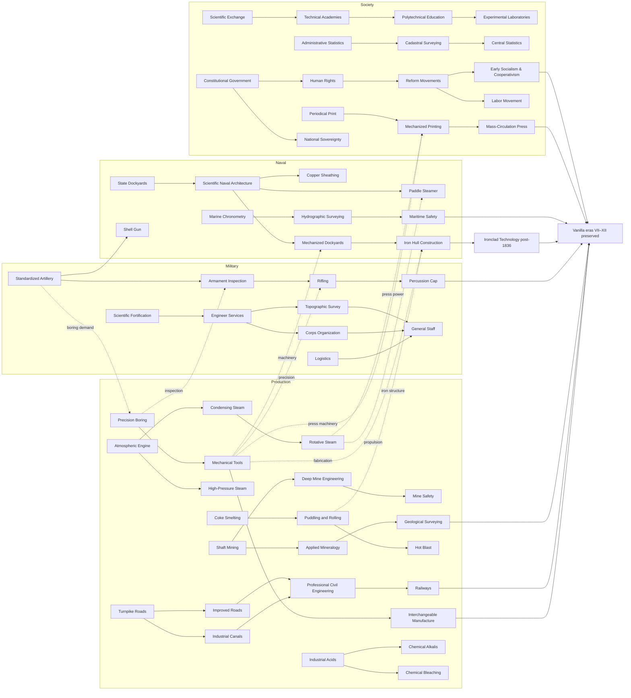

# TECH-2 — Integrated Technology Tree 1700–1836 V1

Status: `TECH2H_HUMAN_FREEZE_REVIEW_PASS` · `CANONICAL_PLAN_BEFORE_IMPLEMENTATION` · `NO_GAMEPLAY_CHANGE`

Baseline: Victoria 3 1.13.9 / twelve-era engine validated by TECH-0P. This document designs eras I–VI only. The machine-readable authority for individual nodes is `TECH_TREE_1700_1836_INTEGRATED_V1.csv`.

## 1. Executive Summary

The integrated graph contains 118 technologies: 42 Production, 21 Military, 15 Naval and 40 Society. TECH-2H reviewed all 30 proposed cross-branch edges and retained only 14 as hard prerequisites. Static validation finds zero broken references, zero prerequisite cycles, zero orphan technologies and zero technologies without AI context metadata. `international_relations` is an intentionally independent foundational node with direct vanilla unlocks, not an orphan.

The period is organized into six provisional eras: I (c.1690–1719), II (1720–1749), III (1750–1774), IV (1775–1799), V (1800–1824) and VI (1825–1849). The 1836 start date is not treated as a hard intellectual boundary. Era VI deliberately hosts transitions that mature around 1840 while retaining explicit bridges into later vanilla content.

Public V1 requires `salt` and `spices`. Every other proposed new good remains optional/deferred. Industrial Knowledge is excluded from the base graph pending pacing tests. Core 1776 AI has no third-party dependency.

## 2. Canonical Human Decisions

- Preserve post-1836 vanilla by default; reevaluate 1700–1836 historically.
- Prefer `KEEP → RETIME → REWIRE → SPLIT → RENAME → REPLACE` and preserve vanilla IDs/names where practical.
- Keep Optical Telegraph Networks distinct from Electric Telegraph, Iron Hull Construction from Ironclad Technology, and Hydraulic Cements from Reinforced Concrete.
- Keep early political/intellectual antecedents distinct from mature anarchism, organized feminism, later socialism and modern psychiatry.
- Require salt and spices in public V1; defer copper, industrial chemicals, cement, pharmaceuticals and other new goods.
- Give direct POP salt consumption a zero minimum share. Early military supply consumes salt plus cereals; advanced groceries-based supply does not consume salt a second time.
- Use Great Wave 1.13 architecture. Copper Sheathing is a real component proposed for existing `ship_mod_slot_utility_2`; no new slot definition is created, and runtime/default-template validation remains mandatory.
- Diagonal Ship Framing directly gates the two existing vanilla Seppings-Braced Hull armor modifications; it does not duplicate them with a shipyard modifier.
- Use progressive, state-attached geological discovery bounded by hidden deposits.
- Give every researchable technology general contextual AI metadata; country flavor and advanced archetypes remain later layers.

## 3. Era Structure

| Era | Window | Nodes | Role | Proposed relative band |
|---|---|---:|---|---|
| I | c.1690–1719 | 13 | inherited institutions and first practical pivots | `BAND_A_LOWEST` |
| II | 1720–1749 | 6 | early diffusion and administrative measurement | `BAND_B_LOW` |
| III | 1750–1774 | 19 | pre-revolutionary acceleration and specialization | `BAND_C_LOW_MEDIUM` |
| IV | 1775–1799 | 28 | revolutionary-era convergence and first mechanization | `BAND_D_MEDIUM` |
| V | 1800–1824 | 33 | industrial scaling and professional systems | `BAND_E_MEDIUM_HIGH` |
| VI | 1825–1849 | 19 | railway/geology/general-staff transition into vanilla | `BAND_F_HIGH` |

Bands are ordinal proposals, not gameplay costs. Nodes with three or more genuine dependencies are tagged `CONVERGENCE`; roots are `FOUNDATIONAL`; the remainder are `STANDARD`.

## 4. Production Tree

The 42-node Production branch retains the historical backbones required by the human brief:

- mining: Shaft Mining → Deep Mine Engineering → Mine Safety Engineering, with Applied Mineralogy → Geological Surveying as the knowledge/discovery path;
- steam: Atmospheric Engine → Condensing Steam Engines → Rotative Steam Power, while High-Pressure Steam branches from atmospheric power plus machine tooling;
- machine tools: Precision Boring → Mechanical Tools → Interchangeable Manufacture;
- metallurgy: Coke Smelting → Puddling and Rolling → Hot Blast Smelting;
- textile: Mechanized Spinning → Advanced Spinning → Mechanized Weaving;
- transport: Turnpike Road Networks → Industrial Canals / Improved Road Engineering → Professional Civil Engineering → Railways;
- agriculture: Improved Husbandry → implements, rotations and breeding, then drainage/mechanization;
- chemistry: Industrial Acids → Chemical Bleaching / Industrial Alkalis, with salt as a required input candidate rather than a one-use micro-good.

No generic Factory Organization node is restored. Factory organization remains a building/ownership/qualification/PM representation problem.

## 5. Military Tree

The 21-node Military branch separates weapons, doctrine, engineering, logistics and health. Regulated Small Arms feeds Light Infantry Tactics; Standardized Field Artillery and Precision Boring converge on Armament Standardization & Inspection; Rifling additionally requires Mechanical Tools. Corps Organization, topographic surveying and logistics converge on General Staff.

Mysorean Iron-Cased Rocketry is `REGIONAL_INNOVATION`, not a universal European starting technology. The later Standardized Military Rocket Systems node may be reached from general artillery/explosive and inspection capabilities without forcing every country to own the Mysorean regional node. Transfer/event design remains a later implementation concern.

## 6. Naval Tree

The 15-node Naval branch uses Great Wave’s actual separation of ship type, propulsion, guns, armor/protection, range, utility, shipyard capacity and runtime templates.

- State Dockyard Systems and Enclosed Dock Systems establish military/civil capacity separately.
- Scientific Naval Architecture enables design capability, not a fictional hull slot.
- Marine Chronometry, Hydrographic Surveying, classification, safety and lighthouse optics are country/port/navigation effects.
- Paddle Steamer rewires propulsion and shipbuilding and requires Rotative Steam Power. High-Pressure Steam is contextual synergy, not a hard prerequisite: early paddle propulsion did not universally depend on it.
- Mechanized Naval Dockyards is a shipyard PM/capacity unlock.
- Diagonal Ship Framing directly unlocks vanilla `ship_mod_frigate_armor_medium` and `ship_mod_ship_of_the_line_armor_medium`, both localized as Seppings-Braced Hull and using `ship_mod_slot_armor`.
- Shell Gun is a guns-slot weapon unlock.
- Iron Hull Construction is a structural ship-type/hull step and bridges to, but is not, `ironclad_tech`.

## 7. Society Tree

The 40-node Society branch models capability rather than a Westernization ladder. It covers administration, statistics, public credit, capital markets, insurance, scientific exchange, diplomacy, education, medicine, print, political discourse and mobilization.

The applied-science backbone is preserved:

`Institutionalized Scientific Exchange → Specialized Technical Academies → Polytechnical Education → Experimental Research Laboratories`.

Political nodes unlock or weight institutions and movements; they do not automatically impose laws. Human Rights and National & Popular Sovereignty remain distinct. Early Socialism & Cooperativism does not retroproject mature later socialist or anarchist movements into the eighteenth century.

`international_relations` is preserved under its vanilla ID and name. TECH-1A classified its former match to Institutionalized Scientific Exchange as `NAME_COLLISION_ONLY`; diplomatic treaty mechanics therefore remain on their own node.

## 8. Cross-Branch Dependencies

TECH-2H reviewed all 30 proposed edges: 14 remain hard prerequisites, 11 were weakened to AI/contextual synergy and 5 were removed as false dependencies. The retained hard edges are:

| From | To | Dependency represented |
|---|---|---|
| Standardized Field Artillery | Precision Boring | artillery-boring demand |
| Precision Boring | Armament Inspection | industrial inspection capability |
| Mechanical Tools | Rifling | reproducible precision manufacture |
| Veterinary Science | Military Veterinary Services | medical knowledge |
| Rotative Steam Power | Paddle Steamer | practical marine propulsion |
| Mechanical Tools + Rotative Steam | Mechanized Naval Dockyards | machinery and power |
| Puddling/Rolling + Mechanical Tools | Iron Hull Construction | structural iron and fabrication |
| Pressed Glass | Modern Lighthouse Optics | optical material capability |
| Tools + steam + continuous paper | Mechanized Printing | machine and feedstock convergence |
| Industrial Acids | Active-Principle Pharmacy | chemical isolation infrastructure |

Same-era prerequisites are allowed only where they express a real convergence; they are not used to force linear chronology.

## 9. Salt Integration

Salt is `REQUIRED`, represented by one good and two production families: solar/saline works and rock-salt mining. Known exploitable potential exists in setup; later geological systems may reveal specialized/hidden deposits without spawning salt everywhere.

Planned technological anchors are:

- Shaft Mining: rock-salt extraction PM/building path;
- Industrial Acids → Industrial Alkalis: enabling acid chain followed by the direct salt-consuming alkali/Leblanc sink;
- Canneries: preservation/processed-food sink;
- Logistics: early salt+cereal supply, replaced by advanced groceries supply without double counting.

Direct POP consumption is permitted only with `SALT_POP_MINIMUM_SHARE = 0`. Exact weights, capacities, map and PM quantities remain implementation/runtime-validation tasks. Salt alone must never cause mass famine when other calories are abundant.

## 10. Spices Integration / Audit Status

`SPICE_REFERENCE_MOD_AVAILABLE = YES`. TECH-1D audited Basileia Romaion 1736 version 1.5.0. Its luxury need, plantation, Food Industries inputs, 131-region map and export stance are reference evidence only. No code, values, assets or localization were copied.

Spices are `REQUIRED`, but they are not “invented” by a technology. Regional starting production and ecology precede the tree. Improved Husbandry/Implements anchor plantation improvement; finance/trade nodes support commercialization; Canneries/food processing provide a later sink. POP weights, minimum share, production values, exact map, setup and trade balance remain `DEFERRED_PENDING_1776_SPICE_DESIGN`.

## 11. Resource Discovery Architecture

`RESOURCE_DISCOVERY_V1 = PROGRESSIVE`:

1. Known, accessible deposits have potential at setup.
2. Hidden/specialized deposits retain a state-level geological ceiling and hidden remainder.
3. Monthly or quarterly candidate checks evaluate technology, geology, effort, access, administration and mining activity.
4. Discovery size is proportional to remaining hidden deposit and can never exceed the geological cap or make the hidden remainder negative.
5. Discovered potential is state-attached and survives ownership changes.

Geological Surveying opens later Coal Geology, Ore Geology, Industrial Minerals and Petroleum Geology families in eras VII–XII. It does not reveal coal/iron everywhere. Foreign prospecting and secret survey knowledge are deferred.

## 12. Ship Designer Integration

Copper Sheathing remains a real `ship_modification`, but TECH-2H changes the proposed mapping from `ship_mod_slot_utility_1` to existing `ship_mod_slot_utility_2`. On the wooden frigate and ship-of-the-line, utility 1 already competes with patrol boats, large carronades and landing skiffs; armor must remain available for Seppings bracing, and range must remain available for stowage. Utility 2 is therefore the only non-exclusive existing candidate. Adding it to those two wooden type allow-lists requires runtime/default-template validation, but creates no new slot definition.

Vanilla 1.13.9 already contains `ship_mod_frigate_armor_medium` and `ship_mod_ship_of_the_line_armor_medium`, both localized as Seppings-Braced Hull. They occupy `ship_mod_slot_armor`, cost hardwood in construction, and add armor plus hit points. They currently have no `unlocking_technologies`. Diagonal Ship Framing will gate both objects directly; the former duplicate shipyard/building modifier is removed from the plan. Copper Sheathing remains compatible because it uses a separate utility slot.

Implementation must provide technology gating, type allow-lists, contextual AI weight, default-template inclusion, custom-template behavior and a non-DLC default path. The Copper Sheathing economic input is `UNRESOLVED_PENDING_IMPLEMENTATION_DESIGN`; the copper good remains deferred.

## 13. AI Research Architecture

V1 uses `BASE_TECH_WEIGHT × GENERAL_CONTEXT`. Every row has a non-empty AI base class and context tags covering relevant subsets of geography, economy, military, society and neighboring technology state. Country-specific research AI is not part of V1.

General context may raise/lower weights for coasts, rivers, landlocked status, resources, shortages, prices, agriculture, mining, industry, army/navy needs, rivals, literacy, universities, bureaucracy and mortality. Context changes ranking; it never bypasses prerequisites, eras or ahead penalties.

## 14. Economic AI Chain Architecture

`CORE_1776_AI_EXTERNAL_DEPENDENCY = NONE`. Each economic technology is tagged with a chain ID connecting:

`unlock → potential/producer → production PM → output → first consumer → mature consumers → bootstrap → shortage recovery → overproduction brake → trade policy`.

Salt, spices, naval supply and resource discovery require targeted V1 handlers designed as the first layer of a later generic 1776 AI Core. Kuromi/KAI, Tech & Res, La Gabelle and Basileia remain references only.

## 15. 1776 Starting-Technology Classification

The CSV classifies all nodes without modifying country setup:

| Adoption class | Count |
|---|---:|
| widely established before 1776 | 5 |
| regionally established before 1776 | 14 |
| frontier / limited adoption in 1776 | 19 |
| post-1776 | 80 |

Scope metadata contains 103 universal, 12 universal-starting-differential, 2 event-acquired-universal and 1 regional-innovation nodes. These are categories for later setup research, not automatic grants.

## 16. Vanilla Preservation / Reuse Matrix

| Action | Count | Meaning in this plan |
|---|---:|---|
| KEEP | 10 | concept remains viable with minimal intervention |
| RETIME | 19 | historical placement changes |
| REWIRE | 7 | role/name broadly retained but dependencies change |
| SPLIT | 21 | vanilla node compresses distinct historical capabilities |
| MERGE | 2 | duplicate vanilla concepts collapse into one integrated node |
| RENAME | 0 | no cosmetic renaming accepted |
| REPLACE | 0 | no full replacement needed after consolidation |
| NEW | 59 | no adequate vanilla node |

Twenty-one rows preserve a vanilla name and ID directly; 38 historically necessary split/rewire rows do not; 59 new nodes have no vanilla name to preserve. Examples retained include Shaft Mining, Atmospheric Engine, Cotton Gin, Mechanical Tools, Canneries, Railways, Paddle Steamer, Logistics, Percussion Cap, General Staff, Shell Gun, Stock Exchange, Medical Degrees, Human Rights, Postal Savings, Labor Movement and International Relations.

## 17. Post-1836 Transition

Era VI bridges forward without reconstructing eras VII–XII. Explicit protected transitions include:

- Optical Telegraph Networks → Electric Telegraph;
- Iron Hull Construction → Ironclad Technology;
- Hydraulic Cements → Reinforced Concrete;
- Hot Blast Smelting → Bessemer and later steelmaking;
- Railways → later rail/rolling-stock systems;
- Percussion Cap → repeaters and bolt-action weapons;
- Early Socialism & Cooperativism → mature later socialist/anarchist movements;
- Geological Surveying → specialized geological families.

Post-1836 vanilla successors stay in place by default until their own integration phase.

## 18. Pacing Risks

The 118-node half-tree is denser in eras IV–V (28 and 33 nodes). The band proposal therefore requires runtime testing for optimized human completion, normal AI progression, spread and ahead penalties. Industrial Knowledge is not included in the baseline. It becomes required only if a highly optimized player cannot complete the intended full-game tree without absurdly low costs.

No numeric technology cost is frozen here. Era bands express order only and must be calibrated with the certified 12-era runtime harness.

## 19. Technical Risks

- Vanilla unlock redistribution after SPLIT can silently strand buildings, PMs, laws or ship objects.
- Great Wave type allow-lists, default templates and non-DLC behavior make naval rewires high risk.
- Salt/spice maps and starting supply can create global shortages before AI reacts.
- Progressive discovery needs idempotent save/load state and bounded candidate scans.
- Same-era convergence must remain acyclic after implementation IDs are finalized.
- Interface density, localization and icon coverage must be validated for 118 early nodes.
- No `BASELINE_*` placeholder may enter gameplay prerequisites; they only describe pre-1690 knowledge.

## 20. Deferred Systems

Industrial Knowledge, patents, knowledge trade, industrial espionage, technology licences, secret survey knowledge, unrestricted foreign prospecting, new Ship Designer slots, full post-1836 redesign, country flavor AI, advanced strategic archetypes, final artwork and new goods other than salt/spices remain deferred. Copper, industrial chemicals, cement and pharmaceuticals may be referenced conceptually but are not public-V1 requirements.

## 21. Implementation Order

1. Freeze IDs/names and audit every SPLIT/MERGE unlock transfer against vanilla references.
2. Implement eras I–VI and technology definitions with placeholder icons/localization stubs.
3. Implement setup/adoption mapping without universalizing regional knowledge.
4. Implement salt and spices supply before adding mandatory demand.
5. Implement cross-branch PM/building/ship unlocks and progressive resource discovery.
6. Implement contextual research AI and targeted chain bootstrap/import/recovery logic.
7. Run static graph/object checks, then focused runtime suites, then long hands-off tests.
8. Replace placeholder artwork only after mechanics and pacing stabilize.

Technology placeholder: `gfx/error_manul.dds`. Building placeholder: `gfx/error_deer.dds`.

## 22. Validation Gate

Before public release, static checks require zero new techs without AI weight, missing icon/description, broken prerequisite, orphan good/building/PM/PMG or unresolved external dependency. Runtime checks require all eligible new techs to be researchable by AI, every required chain bootstrap/import path to work, salt-alone famine to remain impossible, discovery to remain idempotent across save/load, valid AI naval designs and zero critical long-run failures.

TECH-2H passes the **human design/static graph gate only**: 118 unique nodes, 30 proposed cross-branch edges reviewed, 14 hard cross-branch edges retained, zero broken graph references, zero cycles, zero orphan nodes and zero missing AI contexts. Gameplay-object and runtime gates are intentionally pending implementation.

## 23. Visual Tree

The diagram shows the structural backbone and major convergences. The CSV contains every secondary branch and exact successor.

`TECH2H_FREEZE_REVIEW = PASS` and `TREE_READY_TO_FREEZE = YES` for consolidated design and static graph review. No gameplay implementation, commit or push is authorized by this phase.
