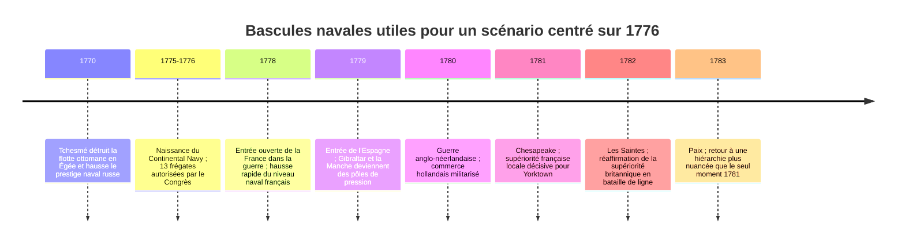
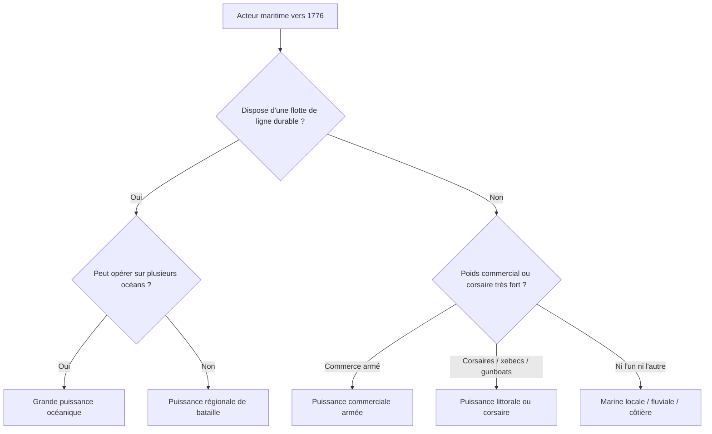

# WORLD_NAVIES_1776_THE_GREAT_WAVE_ROADMAP

## Résumé exécutif

Le sujet réel n’était pas « la méthode de recherche en général », mais bien une demande de cartographie comparative des marines du monde autour de 1776 pour un mod de stratégie navale. Le cahier des charges demande explicitement une vue mondiale, centrée sur la période 1770–1780, avec comparaison des puissances, des ports majeurs, des compagnies commerciales armées et une traduction en logique de gameplay.

La conclusion la plus robuste est la suivante. En **1776 strict**, la **Royal Navy** est la seule marine vraiment globale, capable de tenir en même temps la Manche, l’Atlantique nord, les Antilles, Gibraltar, l’Inde et l’escorte du commerce impérial. **La France** est la seule puissance qui redevient, après 1778, une quasi-paire navale crédible à l’échelle océanique, grâce à sa remobilisation rapide et à ses grands arsenaux atlantiques et méditerranéens. **L’Espagne** constitue ensuite la troisième grande flotte, très puissante en ligne de bataille et en arsenaux impériaux, mais souvent plus dispersée et moins agressive doctrinalement que la Grande-Bretagne. **Les Provinces-Unies** restent une immense puissance commerciale et logistique, avec des navires marchands armés et la VOC, mais leur flotte d’État n’a plus le poids politique et tactique du XVIIe siècle. **La Russie**, **l’Empire ottoman**, **la Suède**, **le Danemark-Norvège** et **le Portugal** sont des puissances navales réelles mais surtout **régionales ou semi-globales**, importantes dans certains bassins, moins décisives à l’échelle mondiale. Le **Continental Navy** américain, en 1776, reste très petit ; son effet historique passe davantage par les **frégates, les corsaires et l’attrition commerciale** que par une ligne de bataille classique.

Pour un mod, la meilleure solution n’est pas de donner à chaque État un score abstrait unique, mais de distinguer cinq familles de puissance : **majeure océanique**, **majeure impériale secondaire**, **régionale de bataille**, **littorale/corsaire**, **commerciale armée**. Cette grille rend bien mieux l’état du monde vers 1776 qu’un simple classement linéaire, car elle explique pourquoi la Hollande peut être extrêmement riche sans dominer la mer, pourquoi l’Empire ottoman reste dangereux en Méditerranée orientale sans être un rival atlantique, ou pourquoi le Japon de l’époque a un trafic maritime considérable sans posséder de flotte de guerre comparable aux grandes marines européennes.

Cette chronologie montre que **1776** n’est pas un point fixe, mais un **moment de transition**. Le mod gagnera donc à distinguer un état de départ « 1776 » d’un état « 1778–1782 » où la France et l’Espagne montent nettement en puissance.

## Périmètre et méthode

Je prends ici « 1776 » au sens demandé dans le brief : **autour de 1776**, donc avec latitude pour mobiliser des indices situés entre **1770 et 1780**, et parfois 1781–1783 lorsque ces événements révèlent des structures déjà en place en 1776 ou presque. C’est indispensable, car les marines du XVIIIe siècle fluctuent vite selon que l’on compte les vaisseaux en service, en armement, en réserve, en chantier ou affectés à des escadres lointaines.

Concrètement, j’ai privilégié quatre types d’indices : les **grands engagements** qui révèlent la masse effective des flottes, les **arsenaux et chantiers** qui révèlent la capacité de remplacement, les **mises à l’eau et commissions** qui révèlent la mobilisation, et enfin les **compagnies de commerce armées** qui révèlent la militarisation indirecte du trafic. Les chiffres précis varient selon les auteurs, mais les ordres de grandeur et les hiérarchies ressortent clairement : la France met rapidement en service plusieurs nouveaux vaisseaux de 74 et 80 canons à partir de 1778–1779 ; l’Espagne peut mobiliser de grandes masses navales depuis Ferrol, Cadix, Carthagène et La Havane ; la flotte russe démontre une capacité expéditionnaire depuis la Baltique mais ne dispose d’une flotte de mer Noire permanente qu’à partir de 1783 ; la VOC aligne des Indiamen lourdement armés, mais cela ne remplace pas une grande battlefleet d’État.

Pour le design de jeu, j’applique une règle simple : il faut modéliser séparément **la puissance de bataille**, **la portée géographique**, **la résilience industrielle**, **le poids commercial** et **la nuisance corsaire**. C’est ce qui évite, par exemple, de surévaluer la Hollande comme flotte de ligne ou de sous-évaluer l’Amérique insurgée, dont l’effet naval passe surtout par les frégates et la guerre de course.

## Hiérarchie mondiale des marines

La hiérarchie la plus défendable, pour un départ de campagne vers 1776, est la suivante.

**Premier rang : Grande-Bretagne.** La Royal Navy demeure la référence absolue. Le simple fait que le gigantesque *Victory* ne soit commissionné qu’en 1778 parce qu’on estime la station nord-américaine déjà suffisamment couverte dit beaucoup de la profondeur britannique ; à cela s’ajoutent la capacité à protéger Gibraltar, à gagner encore une bataille majeure comme les Saintes en 1782, et à lancer de nouvelles classes de frégates plus lourdes au tournant 1778–1780.

**Deuxième rang : France, puis Espagne.** La France est la seule puissance qui remonte vers une véritable parité navale locale avec la Grande-Bretagne. L’entrée française dans la guerre en 1778 ouvre immédiatement la phase d’expansion la plus décisive du conflit, et les mises en service très rapprochées de vaisseaux comme *Scipion*, *Annibal*, *Neptune*, *Auguste* ou *Bellone* illustrent cette mobilisation. L’Espagne n’est pas aussi agile tactiquement que la Grande-Bretagne, mais sa masse impériale est énorme, avec des arsenaux péninsulaires et surtout l’appui de La Havane, qui fut l’un des plus grands chantiers du monde ibérique du XVIIIe siècle.

**Troisième rang : Provinces-Unies, Russie, Danemark-Norvège, Suède, Empire ottoman, Portugal.** Ces puissances sont très différentes entre elles. Les Provinces-Unies gardent un poids commercial colossal et des navires marchands armés, mais leur flotte d’État est moins impressionnante que leur réputation commerciale. La Russie a déjà prouvé, avec Tchesmé et l’expédition baltique en Méditerranée, qu’elle peut projeter de la force loin de ses bases, mais sa vraie montée à la mer Noire n’est stabilisée qu’après 1783. Le Danemark-Norvège et la Suède ont de **vraies battlefleets baltique**, sérieuses, bien appuyées par Copenhague/Nyholm et Karlskrona, mais elles restent majoritairement régionales. L’Empire ottoman, malgré le désastre de Tchesmé, n’est pas une marine négligeable : il reconstitue des capacités, garde un fort ancrage égéen et levantin, et réforme son appareil naval sous Cezayirli Hasan Paşa. Le Portugal, enfin, demeure une marine impériale moyenne mais réelle, structurée par Lisbonne, le Brésil et les routes océaniques.

**Quatrième rang : Venise, Maroc et Régences barbaresques, Oman, Naples/Sicile.** Ici, il faut changer d’échelle. Venise possède encore une vraie tradition d’arsenal et des vaisseaux de ligne, mais sa puissance politique n’est plus celle d’un grand joueur systémique. Les forces marocaines et barbaresques ne rivalisent pas en ligne de bataille avec les grandes monarchies européennes, mais elles comptent sérieusement dans le jeu méditerranéen grâce aux xebecs, galiotes et corsaires ; elles sont donc souvent **sous-estimées** si l’on raisonne seulement en « vaisseaux de ligne ». Oman reste un acteur important du couloir Arabie–golfe–Afrique de l’Est, mais à la fin du XVIIIe siècle son pic de domination maritime est déjà derrière lui. Pour Naples/Sicile, l’existence d’une marine bourbonienne régionale est certaine, mais la documentation collectée ici est trop mince pour aller au-delà d’un classement prudent en acteur secondaire côtier.

**Cinquième rang : Continental Navy et puissances asiatiques non océaniques au sens européen.** En 1776, le Continental Navy existe, mais en miniature ; les treize frégates autorisées et quelques croiseurs ne changent pas le rapport de force de ligne. En revanche, les corsaires américains produisent une nuisance commerciale très supérieure à ce que suggère la petite taille de la flotte régulière. Pour la Chine des Qing, le Japon des Tokugawa, la Corée Joseon, le Siam, la Birmanie ou le Vietnam, il faut éviter le contresens : ces États ont parfois beaucoup de bateaux, de transports, de jonques armées ou de dispositifs côtiers, mais **pas** de marine de haute mer comparable aux battlefleets atlantiques. Le Japon d’Edo a un système maritime interne très actif, mais ne possède un premier navire de guerre « occidental » qu’au milieu du XIXe siècle ; la Chine impériale opère surtout à travers des jonques de défense côtière et d’anti-piraterie ; la Corée reste avant tout une tradition de défense littorale.

## Tableau synthétique par puissance

Le tableau ci-dessous ne donne pas un « score historique absolu » ; il propose une **traduction modding** entre hiérarchie réelle, type de flotte et niveau de représentation recommandé.

| Acteur | Profil naval vers 1776 | Niveau suggéré dans le mod | Représentation recommandée | Confiance |
|---|---|---|---|---|
| Grande-Bretagne | Seule thalassocratie pleinement globale ; battlefleet, convois, garnisons, artillerie navale, frégates lourdes | **S** | Référence de balance ; meilleure endurance, rotation d’escadres, capacité multi-théâtres | Élevée |
| France | Quasi-paire navale après 1778 ; forte montée en puissance grâce aux arsenaux atlantiques et méditerranéens | **A+** | Très forte accélération par événements entre 1778 et 1781 ; excellente qualité de vaisseaux de 74 | Élevée |
| Espagne | Grande flotte impériale, arsenaux majeurs, forte masse mais emploi souvent plus prudent | **A** | Puissance de ligne et de siège ; excellente logistique impériale ; bonus Ferrol/Cadix/La Havane | Élevée |
| Provinces-Unies | Géant commercial ; VOC et Indiamen armés ; flotte d’État moins dominante qu’au XVIIe siècle | **B+** | Commerce, convois, richesse, Indiamen armés ; battlefleet inférieure au trio GB/FR/ESP | Moyenne à élevée |
| Russie | Grande puissance en Baltique ; preuve de projection avec Tchesmé ; transition avant la mer Noire permanente | **B+** | Forte en Baltique ; capacité d’expédition ; montée de puissance événementielle après 1783 | Moyenne à élevée |
| Empire ottoman | Flotte régionale importante mais fragilisée après Tchesmé ; recomposition égéenne et levantine | **B** | Méditerranée orientale, détroits, xebecs, défenses portuaires ; moins performante en bataille océanique | Moyenne |
| Danemark-Norvège | Vraie battlefleet baltique et navires de ligne, surtout défensive et d’escorte | **B** | Très solide en Baltique/Nord ; moins pertinente outre-mer sauf convois | Moyenne |
| Suède | Grande tradition de base navale à Karlskrona ; flotte stratégique régionale | **B** | Bonne qualité en Baltique ; avantage de base et d’archipel ; portée limitée | Moyenne |
| Portugal | Marine impériale moyenne mais réelle, structurée par Lisbonne et l’axe atlantique brésilien | **B-** | Escorte, liaisons impériales, quelques vaisseaux lourds ; moins dense que l’Espagne | Moyenne |
| Venise | Arsenal prestigieux, encore quelques vaisseaux de ligne, mais puissance systémique en déclin | **C+** | Acteur régional adriatique/levantin ; faible capacité de remplacement | Moyenne |
| Maroc | Marine corsaire et de guerre légère ; confrontation réelle avec les Provinces-Unies dans les années 1770 | **C** | Xebecs, galères, razzia, captures, pression de détroit | Moyenne |
| Régences barbaresques | Nuisance corsaire forte ; peu adaptées à la ligne de bataille européenne | **C** | Raids, captures, esclavage maritime, chasse au commerce | Moyenne |
| Oman | Puissance maritime régionale héritée d’un âge d’expansion vers l’Afrique orientale | **C** | Contrôle de nœuds de l’océan Indien occidental ; pas de grande battlefleet européenne | Moyenne |
| Naples/Sicile | Petite marine bourbonienne régionale ; rôle surtout côtier et politique | **C-** | Ports utiles, escadres modestes, valeur régionale plutôt que stratégique mondiale | Faible ; point à documenter davantage |
| Continental Navy | Flotte régulière très petite mais symbolique ; 13 frégates autorisées ; potentiel surtout corsaire | **D+** | Frégates, sloops, gunboats, privateers ; faiblesse en ligne, forte nuisance commerciale | Élevée sur la faiblesse relative |
| VOC / compagnies néerlandaises | Commerce armé lourd ; navires marchands parfois fortement canonnés | **Spécial commerce** | À traiter comme flotte commerciale militarisée, non comme marine de ligne | Élevée |
| EIC britannique | Indiamen armés, relais stratégique mondial, soutien indirect à la puissance britannique | **Spécial commerce** | Bonus logistique, escorte et transport ; armement lourd mais rôle marchand | Moyenne à élevée |
| HBC | Navigation surtout logistique et régionale | **Spécial commerce** | Peu utile en bataille ; utile pour ravitaillement, arctique et postes | Moyenne |
| Compagnie des Indes française | La grande compagnie a été liquidée en 1770 ; la marine royale reprend le premier rôle | **Éviter une forte flotte autonome en 1776** | Lorient et le commerce restent utiles, mais pas comme grande force quasi étatique en 1776 | Élevée |
| Qing | Nombreuses flottilles, jonques armées, défense côtière et anti-piraterie plutôt que battlefleet | **D** | Jonques, rivières, littoral, pirates ; ne pas modéliser comme France ou GB | Moyenne |
| Japon Tokugawa | Réseau maritime intérieur actif, mais pas de flotte de guerre océanique moderne en 1776 | **D** | Transport, cabotage, commerce intérieur ; très faible score de guerre navale océanique | Moyenne à élevée |
| Joseon | Tradition forte de défense côtière, mais pas de marine océanique de premier rang au XVIIIe siècle | **D** | Défense littorale, batteries, petits bâtiments | Moyenne |
| Siam | Flottes surtout fluviales et côtières ; usage royal et militaire local | **D** | Contrôle des embouchures et rivières, pas d’affrontement en ligne de bataille | Faible à moyenne |
| Birmanie / Vietnam / Perse | Capacités surtout régionales, fluviales ou côtières ; documentation ici incomplète | **D** | Acteurs secondaires régionaux, forts côtiers, transports | Faible |

## Ports, théâtres et dynamiques d’événements

Si l’objectif est de placer correctement les villes, il faut distinguer les **ports de bataille**, les **ports d’arsenal**, les **ports de commerce armé** et les **points de passage impériaux**. Côté britannique, les nœuds centraux sont Portsmouth et Plymouth, mais, dans la guerre d’Indépendance, **Gibraltar**, les Antilles et les stations nord-américaines comptent presque autant que les métropoles. Côté français, **Brest**, **Rochefort**, **Lorient** et **Toulon** sont les grands pivots ; Lorient est d’autant plus intéressant qu’il réunit héritage commercial de la Compagnie des Indes et bascule vers le premier rôle de la marine royale après 1770. Côté espagnol, **Ferrol**, **Cadix**, **Carthagène** et **La Havane** sont structurants ; La Havane doit probablement être traitée comme **arsenal impérial majeur**, non comme simple colonie périphérique.

Les bassins les plus importants à scénariser ne sont pas seulement « Atlantique » et « Méditerranée », mais au moins six : **Manche/mer du Nord**, **Atlantique nord américain**, **Caraïbes**, **Méditerranée occidentale/Gibraltar**, **Méditerranée orientale/Égée**, **océan Indien**. La guerre montre très bien que la suprématie mondiale n’est jamais uniforme : en 1781, la France domine localement en baie de Chesapeake ; en 1782, la Grande-Bretagne reprend l’avantage décisif aux Saintes ; à Gibraltar, l’endurance britannique et la contrainte logistique deviennent le vrai cœur du théâtre.

Pour les événements dynamiques, la meilleure structure serait : **entrée française en guerre**, **entrée espagnole**, **guerre anglo-néerlandaise**, **course américaine**, **blocus de Gibraltar**, **bascule Chesapeake**, **retournement des Saintes**. C’est cette séquence qui crée un monde naval intéressant, au lieu de figer définitivement les rapports de force au jour 1.

## Traduction en design de mod

La recommandation la plus forte est de ne **pas** traiter toutes les marines avec le même vocabulaire. Historiquement, un vaisseau de ligne britannique, un Indiaman néerlandais armé, un xebec barbaresque, une jonque côtière qing et une frégate américaine n’occupent pas la même fonction militaire. Les ramener à une seule « puissance navale » produit un résultat trompeur.

Je recommande donc cinq catégories d’unités ou de pools de force. D’abord, la **battlefleet** en vaisseaux de ligne. Ensuite, la **cruising navy** en frégates, sloops et petits croiseurs. Puis la **trade navy armed**, où l’on range EIC, VOC, convois armés et transports défendus. Viennent ensuite les **corsaires et prédation commerciale**. Enfin, les **flottes littorales et fluviales**, très importantes pour l’Empire ottoman, la Chine, la Corée ou le Siam. Un État peut être fort dans une catégorie et faible dans les autres. C’est exactement le cas des Provinces-Unies, des États-Unis insurgés ou des Régences barbaresques.

En termes de balance, un point capital est de donner à la Grande-Bretagne non seulement plus de navires, mais surtout **plus de redondance et de résilience**. La France doit recevoir moins de profondeur initiale mais une **forte courbe ascendante** par événements et chantiers. L’Espagne doit disposer d’une énorme réserve de ports et de convois impériaux. La Hollande doit être forte en richesse, marchands, transports et vulnérabilité stratégique. Les Américains doivent sembler faibles en escadre mais redoutables en guerre de course. Les Ottomans et les Barbaresques doivent être pénibles à neutraliser dans leurs eaux, même s’ils restent inférieurs en haute mer.

## Sources commentées et niveaux de confiance

Les sources les plus utiles pour ce sujet ne sont pas toutes du même type. Les plus solides, pour un usage de modding, sont celles qui décrivent soit les **infrastructures**, soit les **mobilisations de guerre**, soit des **unités précises mises en service**.

| Type de source | Apport principal | Utilité pour le mod | Fiabilité dans ce rapport |
|---|---|---|---|
| Royal Navy / batailles britanniques | Mesure de la profondeur britannique, de Gibraltar aux Saintes | Très forte pour calibrer le haut de l’échelle | Élevée |
| Histoire navale française de la guerre d’Indépendance | Montée en puissance française après 1778 | Très forte pour les événements de rattrapage | Élevée |
| Arsenaux espagnols et La Havane | Capacité industrielle et impériale espagnole | Très forte pour la carte et les bonus portuaires | Élevée |
| VOC et marchands armés | Différence entre puissance commerciale et flotte de ligne | Essentielle pour éviter de mal modéliser la Hollande | Élevée |
| Russie et Tchesmé | Projection baltique et choc infligé aux Ottomans | Forte pour la Baltique et l’Égée | Moyenne à élevée |
| Réformes ottomanes après Tchesmé | Niveau réel de résilience ottomane | Forte pour les flottes régionales | Moyenne |
| Bases scandinaves et escadres baltique | Classement Suède / Danemark-Norvège | Bonne pour une carte baltique crédible | Moyenne |
| Continental Navy et privateering | Rend la guerre américaine navale jouable sans surévaluer la ligne | Cruciale pour l’équilibrage américain | Moyenne à élevée |
| Japon, Qing, Joseon | Empêche les anachronismes en Asie orientale | Très utile pour ne pas occidentaliser la carte | Moyenne |
| Barbaresques et Maroc | Rehausse la guerre de course méditerranéenne | Très utile pour variété des unités | Moyenne |

En pratique, la **confiance par région** est la plus haute pour le triptyque **Grande-Bretagne / France / Espagne**, élevée pour **Hollande / Russie / Scandinavie / États-Unis**, moyenne pour **Ottomans / Maroc / Barbaresques / Oman / Asie orientale**, et faible pour **Naples/Sicile**, **Perse** et une partie de l’Asie du Sud-Est dans ce rapport précis, faute de collecte plus profonde.

## Limites et questions ouvertes

Le point le plus important à garder en tête est que **1776 n’est pas 1778, ni 1781**. Si le mod cherche la photographie du monde exactement au 4 juillet 1776, la France et l’Espagne doivent commencer plus bas qu’elles n’apparaissent dans les grandes batailles ultérieures ; si le mod vise « l’ère 1776 » au sens large de la guerre d’Indépendance, alors il faut intégrer leur montée en puissance par événements.

Les deux zones qui mériteraient une recherche complémentaire si l’on voulait passer d’un bon modèle à un modèle quasi encyclopédique sont, d’une part, la **marine napolitaine/sicilienne** des années 1770, et d’autre part les **marines de l’Asie du Sud-Est continentale** autour de 1776. Dans le présent état du dossier, elles doivent être introduites avec prudence, sous forme d’acteurs littoraux ou secondaires, sans leur attribuer une importance océanique qu’aucune source forte collectée ici ne soutient. Cette limite vaut aussi pour la Perse zand/qadjare de transition.

La synthèse la plus sûre, au final, est donc la suivante : **monde naval de 1776 = suprématie britannique, contrepoids français en gestation, masse impériale espagnole, puissance commerciale hollandaise, ceinture de marines régionales sérieuses, et myriade de forces littorales, corsaires et marchandes armées qu’un bon mod ne doit surtout pas écraser sous une seule statistique**.
