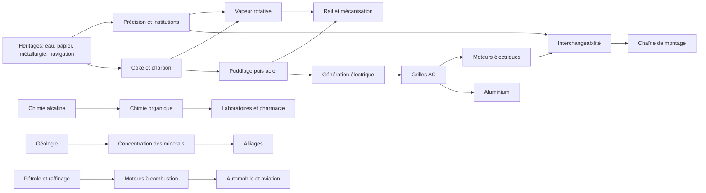

# Refonte de l'arbre industriel — recherche historique approfondie (800-1936)

> **Statut :** recherche et conception uniquement. Aucun fichier gameplay n'est créé ou modifié.  
> **Référentiels :** base de 130 innovations, 32 chaînes, 30 goods évalués, 38 candidats bâtiment/PM, audit vanilla/fork.  
> **Date :** 14 juillet 2026.

## 1. Résumé exécutif

La refonte doit d'abord réparer l'intervalle **1776-1836**, presque invisible dans l'ossature vanilla conçue autour de 1836. Les puissances avancées en 1776 possèdent déjà papier, imprimerie, comptabilité, canaux traditionnels, hauts fourneaux, poudre, navigation océanique et parfois pompe de Newcomen, coke, filatures précoces et chronomètres. Elles ne possèdent pas encore à grande échelle rail, vapeur rotative universelle, métier mécanique, pièces interchangeables, chimie alcaline, vaccination, conserverie ou ciment Portland [S01-S13].

La recommandation initiale est de retenir **35 technologies nouvelles, déplacées ou restructurées**, **9 goods Tier A** dont quatre sont déjà vanilla, **5 bâtiments Tier A** et **16 PM Tier A**. L'architecture historique la plus productive est: héritages régionaux → précision et capital → vapeur/chimie/rail → acier/santé/télécommunications → électricité/chimie fine → pétrole/alliages/production de masse.

Trois erreurs sont à éviter. Premièrement, un prototype ne doit pas ouvrir immédiatement une industrie: réfrigération (1834) devient réseau alimentaire surtout après 1880; aluminium exige Bayer + Hall-Héroult + électricité; pénicilline découverte en 1928 n'est industrialisée qu'après 1943 [S16;S75;S100]. Deuxièmement, les origines ne sont pas une parade exclusivement européenne: papier/imprimerie en Chine et Corée, zinc à Zawar, métallurgies africaines, hydrauliques islamiques et variolisation afro-asiatique sont des héritages réels. Troisièmement, tout matériau historique ne mérite pas un good.

## 2. Méthode de recherche

Chaque innovation a quatre repères: antécédent, percée pratique, adoption commerciale, masse industrielle. Les dates de la base sont des fourchettes, jamais une fausse précision. Les sources institutionnelles fixent artefacts, brevets et premières installations; les monographies replacent diffusion, empire, travail et environnement. Les affirmations contestées sont marquées `CONTESTED`.

La comparaison locale a été réalisée après la recherche historique. Les fichiers vanilla/fork ont été inspectés en lecture seule. Les scores de biens et priorités appliquent exactement les formules du brief; les totaux sont conservés dans les CSV ou tables ci-dessous.

## 3. Limites et définitions

«Industrie» signifie production répétée à échelle marchande avec organisation, intrants, énergie, compétences et débouchés; pas simplement un artisanat remarquable. «Commercial» signifie service ou production durable; «masse» une diffusion suffisante pour transformer marchés et travail. Un transfert n'implique ni copie exacte ni trajectoire linéaire.

La couverture mondiale est asymétrique à cause des sources disponibles. Afrique, Asie du Sud-Est, Russie/Asie centrale et agricultures américaines nécessitent une phase régionale supplémentaire avant attribution pays par pays. Les scores sont des outils de design, non des mesures historiques objectives.

## 4. Chronologie générale 800-1936

| Période | Systèmes structurants | Traitement de jeu |
|---|---|---|
| 800-1450 | eau/vent, papier, xylographie, métallurgies régionales, navigation, hydrauliques islamiques | héritages et starts régionaux |
| 1450-1650 | presse européenne, navigation océanique, hauts fourneaux, poudre, compagnies | starts variables/institutions |
| 1650-1776 | coke, Newcomen, canaux, chronomètres, filature précoce, science quantitative | starts avancés/frontière |
| 1776-1830 | Watt, mule, métier mécanique, puddlage, machine-outil, routes, vaccination, conserverie | nouveau palier explicite |
| 1830-1870 | rail, télégraphe, ciment, Bessemer/Martin, chimie organique, froid, santé urbaine | première ère classique |
| 1870-1900 | électricité systémique, téléphone/radio, aluminium, moteurs, chimie fine | seconde révolution |
| 1900-1936 | Haber-Bosch, alliages, aviation, assemblage, froid électrique, mécanographie | technologies terminales |

## 5. Héritages médiévaux

Le moulin industriel n'est pas européen par nature: roues et engrenages ont mûri dans plusieurs régions. Le papier chinois circule par l'Asie centrale et le monde islamique; la xylographie chinoise et les caractères métalliques coréens précèdent la presse de Gutenberg, sans imposer la même économie éditoriale [S01-S03]. Les traditions africaines de bas fourneau montrent une diversité technique incompatible avec un simple retard linéaire [S06-S07]. L'acier wootz et le zinc de Zawar démontrent une métallurgie sud-asiatique spécialisée [S08-S09]. Al-Jazari documente en 1206 des systèmes de pompage et mécanismes sophistiqués, sans qu'ils déclenchent automatiquement une industrialisation [S10-S11].

**Classement 1776 :** connaissances de départ ou PM régionaux, jamais technologies futures ordinaires.

## 6. Première modernité

Presse, poudre, navigation astronomique, cartographie, comptabilité, assurance et compagnies réduisent les coûts d'information et de risque. Leur rôle est institutionnel autant que mécanique. Les États arsenaux poussent standardisation et fonderies; les compagnies mobilisent le capital mais aussi violence et extraction coloniale. Les brevets peuvent soutenir échange et investissement, mais leur effet causal universel reste débattu [S18-S28].

## 7. Proto-industrialisation

Entre 1650 et 1776, charbon, coke, Newcomen, filature mécanique, canaux et mesures précises forment un ensemble britannique très avancé, non une liste d'inventions isolées. Des proto-industries comparables existent ailleurs, mais la combinaison charbon accessible, salaires, commerce impérial, institutions et savoir mécanique britannique produit une accélération spécifique [S07;S13]. En 1776, Newcomen et coke sont matures dans certains bassins; Watt et Arkwright sont des frontières récentes.

## 8. Première révolution industrielle

Les nœuds jouables sont: vapeur rotative, puddlage-laminage, textiles mécanisés par étapes, machine-outil, routes/canaux et chimie alcaline. Ils changent directement PM, intrants ou infrastructure. Le «factory system» ne doit pas être un bonus abstrait: il combine source d'énergie, transmission, capital fixe, discipline et main-d'œuvre.

## 9. Vapeur, mines et chemins de fer

Pompage → mines profondes → charbon → vapeur est une boucle, non une causalité à sens unique. La locomotive devient système avec rails, gares, ateliers, financement et coordination; 1830 est le jalon interurbain, pas la première locomotive [S09-S15]. Les PM miniers doivent ajouter ventilation et sécurité, pas seulement throughput.

## 10. Sidérurgie et machines-outils

Puddlage (1784), Bessemer/Kelly (1850s), Siemens-Martin (1860s) et Thomas (1878) sont des routes concurrentes avec minerais, vitesse, qualité et sous-produits différents. L'interchangeabilité réelle suit tours, jauges, standards et inspection; elle ne naît pas d'un décret. Après 1900, alliages et outils rapides lient nickel/chrome/tungstène à moteurs, blindage et usinage.

## 11. Chimie industrielle

La séquence recommandée est: acides/alcalis → chlore/blanchiment → engrais/explosifs → chimie organique/aniline → électrochimie → haute pression/catalyse → polymères/pharma. Leblanc et Solvay doivent être des PM alternatifs; Haber-Bosch substitue énergie/capital aux nitrates naturels; aniline ouvre chimie fine. Les coûts environnementaux sont structurants, pas décoratifs [S35-S37;S56;S74].

## 12. Agriculture et alimentation

Les rotations et sélections sont anciennes et multiples; éviter le récit d'une invention britannique unique. Entre 1776 et 1936, mécanisation, drainage, phosphates, nitrates, froid, conserverie et pasteurisation transforment rendements et marchés. Guano est historiquement majeur mais trop étroit pour un good autonome. Phosphates et nitrates ont une géographie et plusieurs usages plus jouables.

## 13. Électricité et communications

Télégraphe (commercial 1839), téléphone (brevet 1876) et radio (expériences multiples des années 1890) sont des réseaux exigeant standards et capital [S48-S49]. L'électricité doit être scindée en **génération**, **transmission AC**, **moteurs industriels**. Le Smithsonian documente le décalage: éclairage d'abord, motorisation d'usine plus tard [S17]. Hydroélectricité doit interagir avec géographie et aluminium.

## 14. Pétrole, moteurs et production de masse

Le good `oil` ne suffit pas à représenter distillation, kérosène, essence et diesel. Un good agrégé **refined_fuels** et une raffinerie rendent le choix économique visible. Quatre-temps, Diesel, automobile et aviation doivent consommer le produit raffiné. La chaîne mobile de 1913 suppose précision, moteurs électriques, convoyeurs, organisation et demande; elle n'est pas un multiplicateur gratuit [S68-S70;S89].

## 15. Médecine et santé publique

Vaccination, assainissement, germ theory, antisepsie et pharma ont des chronologies distinctes. Les égouts sauvent avant consensus microbien; germ theory permet contrôle plus précis; asepsie remplace progressivement antisepsie. La santé est mieux représentée par technologies + institution + PM urbains/hospitaliers. Pénicilline doit rester découverte terminale/événement, non industrie de masse avant 1936 [S41-S42;S60-S63;S99].

## 16. Institutions économiques et scientifiques

Cinq systèmes suffisent: enseignement technique, service géologique, normalisation, laboratoire industriel et crédit industriel. Les banques et compagnies doivent faciliter capital lourd; les laboratoires relient universités aux firmes; statistiques et mécanographie renforcent administration. Ils doivent consommer bureaucratie, papier, services ou qualifications afin d'éviter les bonus gratuits.

## 17. Chaînes causales industrielles

Le document dédié contient 32 chaînes avec liens directs/facilitateurs, délais, régions, infrastructures, goulets et ressources. Les sept combinaisons les plus importantes sont:

1. précision + Watt → vapeur rotative;
2. coke + haut fourneau + puddlage → fer de masse;
3. rail + télégraphe + acier → marché national;
4. chimie organique + laboratoire → colorants/pharma;
5. dynamo + AC + réseau + moteur → usine électrifiée;
6. Bayer + Hall-Héroult + hydro → aluminium;
7. interchangeabilité + électricité + convoyeurs + management → masse.

## 18. Technologies candidates

### Longue liste priorisée (scores sur 50 puis risques/coûts soustraits)

| Technologie proposée | Fenêtre | Prérequis | Déblocage identifiable | Place | Priority score | Classe |
|---|---|---|---|---|---:|---|
| Improved Roads | 1776-1810 | arpentage | infrastructure/PM route | Production | 42 | A |
| Industrial Canals | 1776-1825 | écluses; finance | modifier/bâtiment canal | Production | 41 | A |
| Rotative Steam Engines | 1776-1800 | Newcomen; précision | PM vapeur | Production | 45 | A |
| Puddling and Rolling | 1784-1810 | coke; haut fourneau | PM acier | Production | 44 | A |
| Mechanized Spinning | 1764-1790 | manufactures | PM textile | Production | 40 | A |
| Power Looms | 1785-1825 | filage; vapeur | PM textile | Production | 39 | A |
| Precision Boring | 1774-1800 | lathe | machines/moteurs | Production | 42 | A |
| Screw-Cutting Lathes | 1797-1820 | précision | precision machinery | Production | 43 | A |
| Interchangeable Parts | 1800-1840 | métrologie; machines | PM standardisé | Production | 44 | A |
| Industrial Alkalis | 1791-1830 | chimie quantitative | PM Leblanc | Production | 41 | A |
| Chlorine Bleaching | 1790-1820 | alkalis | PM textile/papier | Production | 37 | B |
| Vaccination Campaigns | 1796-1830 | médecine empirique | institution santé | Société | 36 | B |
| Thermal Canning | 1809-1830 | emballage | PM food | Production | 38 | B |
| High-Pressure Boilers | 1800-1830 | vapeur; tôles | transport vapeur | Production | 40 | A |
| Geological Surveying | 1800-1830 | academia; cartes | prospection | Société/Production | 41 | A |
| Portland Cement | 1824-1860 | chimie; fours | good+bâtiment | Production | 44 | A |
| Railway Systems | 1825-1840 | chaudière; fer | railway | Production | 46 | A |
| Industrial Metrology | 1830-1870 | système métrique | précision/standards | Société | 38 | B |
| Machine-Tool Systems | 1830-1860 | lathes | precision works | Production | 45 | A |
| Telegraph Networks | 1839-1860 | électromagnétisme | infrastructure/modifier | Militaire/Société | 43 | A |
| Mechanical Refrigeration | 1834-1880 | thermodynamique; précision | PM cold chain | Production | 44 | A |
| Organic Chemistry | 1840-1870 | alkalis; academia | aniline/pharma | Production | 45 | A |
| Germ Theory | 1857-1880 | microscope; statistics | health PM/institution | Société | 43 | A |
| Ore Concentration | 1860-1910 | geology; crushers | flotation PM | Production | 40 | A |
| Basic Steelmaking | 1878-1890 | Bessemer; chemistry | Thomas PM | Production | 39 | A |
| Electrical Generation | 1860-1885 | dynamo | power plant | Production | 45 | A |
| Electrical Grids | 1880-1900 | generation; transformers | grid PM/modifier | Production | 44 | A |
| Industrial Electric Motors | 1880-1915 | grids; machinery | unit-drive PM | Production | 45 | A |
| Petroleum Refining | 1860-1890 | oil; distillation | good+raffinery | Production | 46 | A |
| Aluminum Metallurgy | 1886-1910 | electrochemistry; grids | good+bâtiment | Production | 43 | A |
| Industrial Laboratories | 1870-1900 | technical education | institution/company | Société | 40 | A |
| Alloy Metallurgy | 1890-1915 | open hearth; labs | alloy steel PM | Production | 38 | B |
| High-Pressure Chemistry | 1900-1915 | labs; steel; energy | Haber-Bosch PM | Production | 44 | A |
| Scientific Management | 1900-1920 | statistics; corporations | organization PM | Société | 33 | B |
| Assembly-Line Production | 1913-1925 | interchangeability; motors | mass PM | Production | 43 | A |

**Starts 1776 avancés :** coke smelting, atmospheric engine, manufactories, early mechanized spinning, marine chronometers, corporate finance, technical academies.  
**Starts variables :** printing, navigation, blast furnaces, paper, gunpowder, waterpower, accounting, irrigation and metallurgy traditions.  
**Raison de non-ajout :** une technologie ne survit pas si elle n'ouvre ni PM, ni good, ni bâtiment, ni institution/modifier lisible.

### Dépendances

## 19. Ressources et marchandises candidates

**Tier A nouvelles :** phosphates (33), aluminium (35), refined fuels (39), industrial chemicals agrégés (35), pharmaceuticals (30), precision machinery (35), cement (32), nitrates (35), copper (36).  
**Tier A existantes à conserver :** rubber, fertilizer, dye, glass.  
**Tier B conditionnelles :** bauxite, nickel, electrical apparatus, alloy-metals bundle, chromium/manganese.  
**Tier C :** guano, potash, tungsten, pulp, cellulose, sulfuric acid séparé.  
**Tier D :** alumina et concrete comme goods; ce sont étapes internes/non transportées.

Le risque majeur est de recommander neuf nouveaux goods simultanément. Ordre conseillé: cement + refined fuels + industrial chemicals; ensuite precision machinery/pharmaceuticals; enfin cuivre/aluminium/phosphates/nitrates après audit carte et IA.

## 20. Bâtiments candidats

**Tier A :** Cement Works, Oil Refinery, Non-Ferrous Metallurgy Works (conditionnel goods), Pharmaceutical Laboratories, Precision Engineering Works.  
**Possibles :** Copper/Alloy Mine template, séparation Fertilizer & Alkali Works, Cold Storage Network.  
**À faire par PM :** dye factory, abattoir, bottle factory, brickworks, telephone exchange, pulp mill séparé.  
**À ne pas séparer :** guano works, alumina refinery comme niveau de marché autonome, concrete works.

Chaque Tier A possède main-d'œuvre, intrants/produits, localisation, plusieurs PM et rôle commercial. Cold storage échoue provisoirement au test: il est mieux déployé sur ports, rail, ranches, pêcheries et food industry.

## 21. Production methods candidates

**Tier A (16) :** coke blast furnace; puddling/rolling; basic Bessemer; open-hearth recycling; alloy steel; atmospheric pumping; mine ventilation; flotation; chlorine bleaching; synthetic dyeing; superphosphate; Haber-Bosch; fractional refining; vapor-compression refrigeration; unit electric drive; moving assembly line.

**Tier B (8) :** Solvay alkali; thermal/catalytic cracking; electric cold chain; cylinder milling; vacuum sugar; scientific management; mechanized printing; tabulating offices.

Les PM énergétiques doivent substituer intrants et emplois; les PM de sécurité doivent coûter énergie/engines en échange de mortalité et rendement; le management doit consommer paper/services et pouvoir augmenter tension sociale.

## 22. Comparaison avec la vanilla

La vanilla est forte sur les jalons 1850-1936: Bessemer, open hearth, dynamite, vulcanisation, aniline, electrical generation, téléphone, radio, plastics, pasteurization et assembly lines ont déjà tech/PM. Elle est faible sur 1776-1836, canaux/routes, puddlage, précision, ciment, refroidissement fondateur, raffinage et chaîne électrique par étapes.

Le good set est volontairement agrégé. Cela justifie de réutiliser dye, glass, fertilizer, tools, engines et electricity avant toute scission. Le rapport d'écart fournit 50 actions ligne par ligne.

## 23. Comparaison avec le fork

Le fork n'a actuellement aucun remplacement dans les dossiers tech/goods/buildings/PM/PMG/institutions audités. Il hérite la vanilla. Il existe des compagnies et une injection de lois, mais aucune chaîne industrielle alternative. La future refonte part donc d'une base vanilla, non d'un arbre fork déjà divergent.

## 24. Analyse des lacunes

Lacunes fondamentales:

- une vraie ère 1776-1836;
- transport pré-ferroviaire;
- précision/interchangeabilité;
- ciment/construction;
- raffinage/carburant;
- froid;
- génération-grille-moteur;
- minerais pauvres/alliages;
- matérialité de la pharmacie;
- institutions de R&D.

Les lacunes seulement nominales — aniline, vulcanisation, canning, pasteurisation, radio, plastiques — ne justifient pas du contenu parallèle.

## 25. Classement Priority A/B/C/D

**A — fondamental :** 27 technologies du tableau, 9 goods nouveaux potentiels (à phaser), 5 bâtiments, 16 PM.  
**B — fortement recommandé :** standards, vaccination, Solvay, alliages, management, mécanographie, cold chain électrique.  
**C — optionnel :** tungstène autonome, guano, pulp, bicyclettes, gaz manufacturé détaillé, pénicilline terminale.  
**D — rejeté :** concrete/alumina/cellulose comme goods distincts; briqueterie, abattoir, dye factory, telephone exchange comme bâtiments; «innovation» ou «industrialization» comme nœuds abstraits.

Les scores complets de goods sont dans le CSV. Pour les technologies, la formule appliquée est bénéfices (10 critères) moins balance risk et complexity cost; la shortlist évite les propositions à score élevé mais sans mécanique.

## 26. Shortlist finale

1. **Dix innovations structurantes :** papier/imprimerie; haut fourneau+coke; machine à vapeur; machine-outil précise; textiles mécanisés; rail; acier de masse; chimie industrielle; système électrique; moteur+production de masse.
2. **Acquises par puissances avancées en 1776 :** printing, accounting, corporate finance, navigation/hydrography, coke, Newcomen, manufactories, early spinning, technical academies, chronometers.
3. **Accessibles 1776-1836 :** rotative steam, puddling, mule, power loom, improved roads, industrial canals, precision boring, screw lathe, interchangeability, alkalis, vaccination, canning, high-pressure boiler, geological survey, Portland cement.
4. **1836-1870 :** railway system, machine tools, telegraph, refrigeration, organic chemistry, germ theory, Bessemer/open hearth.
5. **Seconde révolution :** grids, motors, telephone/radio, petroleum refining, aluminum, laboratories, basic steel, cold chain.
6. **1900-1936 :** Haber-Bosch, flotation, alloys, aviation, scientific management, assembly line, tabulation.
7. **Goods Tier A :** phosphates, aluminum, refined fuels, industrial chemicals, pharmaceuticals, precision machinery, cement, nitrates, copper; conserver rubber/fertilizer/dye/glass.
8. **Bâtiments Tier A :** cement works, oil refinery, non-ferrous metallurgy, pharmaceutical labs, precision engineering.
9. **PM Tier A :** les 16 listés section 21.
10. **Rejets :** section suivante.

## 27. Propositions rejetées

- **Guano good :** un usage principal, fenêtre courte; trait régional ou source phosphate/nitrate.
- **Alumina good :** intermédiaire mono-usage; étape du PM aluminium.
- **Concrete good :** mélange local non commercial; cement est le marché.
- **Cellulose good :** redonde pulp/wood/industrial chemicals.
- **Industrial glass good :** vanilla glass + PM suffisent.
- **Bicycle good :** mobilité/services, faible décision productive.
- **Brickworks building :** construction PM.
- **Abattoir building :** PM ranch/food déjà présent.
- **Telephone exchange building :** réseau abstrait par urban PM/modifier.
- **Penicillin industry avant 1936 :** anachronisme d'échelle.
- **Tungsten good initial :** stratégique mais trop tardif/étroit; réévaluer après alloy bundle.
- **Technology “Industrialization” :** trop abstraite et sans déblocage.

## 28. Questions nécessitant des recherches complémentaires

1. Matrice pays/régions des starts 1776 avec preuves quantitatives.
2. Gisements 1776-1936 de cuivre, phosphate, nitrate, bauxite et alloy metals compatibles avec la carte.
3. Élasticités/prix et volumes pour nouveaux goods.
4. Capacité IA à choisir PM substituant nitrates/Haber et coal/electricity.
5. Représentation non eurocentrique des agricultures irriguées, textiles et métallurgies.
6. Compatibilité exacte des réseaux/modifiers avec la version locale de l'engine.
7. Faut-il un unique `alloy_metals` ou nickel/chrome séparés?
8. Faut-il remplacer `tools` ou ajouter `precision_machinery`?
9. Traitement des systèmes artisanaux pré-1776 sans pénaliser artificiellement les pays non européens.

## 29. Plan recommandé pour la future refonte

| Phase | Objectif | Fichiers probables | Données/décisions | Risques | Tests |
|---|---|---|---|---|---|
| TECH-0 | audit complet fork | common/technology; history | starts et unlocks | overrides | références/logs |
| TECH-1 | ères/dates/dépendances | technology/eras;technologies | fenêtres; diffusion | pacing | graphe sans cycles |
| TECH-2 | sélection finale | technologies; localization | 35 nœuds max | doublons | unlock audit |
| INDUSTRY-0 | audit goods/buildings/PM | goods;buildings;PM;PMG | matrice input-output | contenu DLC/version | parse; comparaison |
| INDUSTRY-1 | choisir goods | goods;buy_packages;needs | carte; prix; usages | marchés instables | simulations prix/commerce |
| INDUSTRY-2 | choisir bâtiments | buildings; groups | emplois; ownership | IA construction | emploi/profit |
| INDUSTRY-3 | chaînes productives | PM;PMG | ratios; sous-produits | boucles; pénuries | équilibre multi-pays |
| TECH-INDUSTRY-INTEGRATION | lier unlocks | tech;PM;buildings | ordre et alternatives | dead unlocks | scénario unlock |
| TECH-BALANCE | coûts/diffusion | eras;defines;modifiers | literacy/catch-up | snowball | campagnes IA |
| TECH-LOC | EN/FR | localization | terminologie | ambiguïté | clés manquantes |
| TECH-QA | validation | tous fichiers touchés | logs; IA; économie | régression | parse; soak; prices; trade |

Aucune de ces phases n'est exécutée ici.

## 30. Bibliographie

La bibliographie dédiée contient 117 poignées thématiques, les URL/DOI, sujets et niveaux de fiabilité. Les sources centrales sont les presses universitaires, UNESCO, Smithsonian, ASME, ACS, WHO, ITU, ICE et les articles spécialisés. La base CSV renvoie à ces identifiants.

## Incertitudes et désaccords

| Sujet | Conclusion prudente | Confiance |
|---|---|---|
| fer africain | foyers et chronologies multiples; modèles diffusionnistes simples rejetés | CONTESTED |
| filiation Asie-Gutenberg | antériorité asiatique certaine; transfert technique direct non démontré | CONTESTED |
| coke chinois médiéval | usages du charbon attestés; continuité/processus exact à vérifier | MEDIUM_CONFIDENCE |
| Bessemer/Kelly | développements proches et priorité brevetée disputée | CONTESTED |
| Otto/Beau de Rochas | théorie et réalisation pratique distinctes | MEDIUM_CONFIDENCE |
| radio | Hughes, Tesla, Bose, Popov, Marconi et autres contribuent à un système | CONTESTED |
| aviation | «premier vol» varie selon public/contrôlé/autopropulsé | CONTESTED |
| science → industrie | relation bidirectionnelle; atelier et demande précèdent souvent théorie | HIGH_CONFIDENCE |
| pénicilline | découverte 1928, industrie de masse post-1943 | HIGH_CONFIDENCE |

## Contrôle qualité de conception

- [x] invention, application, adoption et masse distinguées dans 130 lignes;
- [x] origines non européennes et transferts documentés;
- [x] chaque industrie Tier A rattachée à une chaîne;
- [x] chaque ressource Tier A possède plusieurs usages ou un rôle géographique/stratégique exceptionnel;
- [x] chaque bâtiment testé contre une représentation PM/institution/modifier;
- [x] chaque technologie shortlistée ouvre une mécanique;
- [x] pré-1776 classé en starts, héritages, institutions ou PM;
- [x] doublons vanilla identifiés;
- [x] rejets documentés;
- [x] sources importantes référencées;
- [x] aucun fichier gameplay modifié par cette mission.

